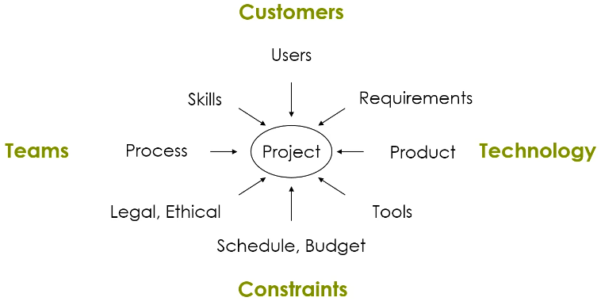
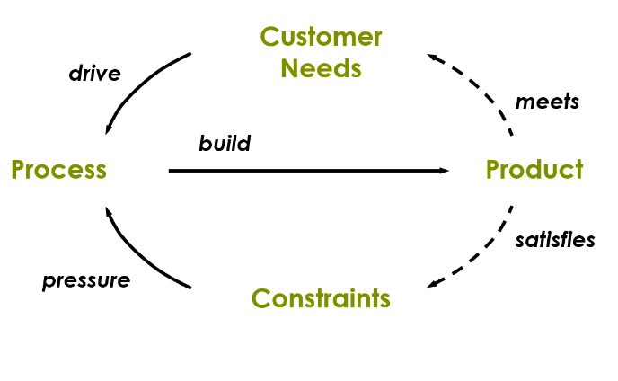

## Definition of Software engineering

Software engineering as described by IEEE:
- Meets customer needs by applying systematic, quantifiable processes to the development and evolution of software products and services subject to resources and other external constraints.

### Drivers (forces) in the definition

A change in any one of these drivers can affect all aspects of a project:
1. Customer: users
2. Processes: team
3. Constraints: context
- have to adhere to safety standards for example
4. Products: technology

Transitive closure: the complete effect on the system given a change
- We need tools to be able o calculate these changes.

### Development cycle

The build process is often called DevOps.

Jama - requirements management system.
- allows change impact analysis

