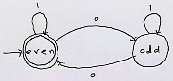

# Finite Automata and Regular Languages

## Definitions

1. An <b>alphabet</b> $\Sigma$ is a finite, non empty set of symbols.
2. A <b>word</b> $w$ over and alphabet is a finite (possibly empty) sequence of symbols from $\Sigma$. The set of all words over $\Sigma$ is denoted $\Sigma^*$.
3. A language $L$ is a subset of the words in an alphabet: $L \subseteq \Sigma^*$.
    - A language can be empty set or all words over the alphabet.

### Example

If $\Sigma = \set {0,1}$ then $\Sigma^*$ is the list of all binary words. 
If $\Sigma = \set {a,b,c,...,x,y,z}$ then $\Sigma^*$ is the list of all possible (coherent and incoherent) words in the English alphabet.

## Terminology

1. $e$ denotes the empty word, independent of the alphabet.
2. $|w|$ denotes the length of a word.
3. $w^r$ is the reverse of $w$.
4. If $w=w^r$ then $w$ is a pallindrome.
5. Concatenation: if $u$ and $v$ are words, then $uv$ is a word that consists of $u$'s symbols followed by $v$'s symbols.
6. Exponention: $a^n$ is $a$ repeated $n$ times.
7. A word $u$ is a subword of $v$ if there exists two words $w_1$ and $w_2$ such that $v = w_1uw_2$.
    - $w_1$ and $w_2$ can be empty.

## Deterministic Finite Automaton (DFA)

A DFA consists of 5 objects: $Q, \Sigma, \delta, s, F$.

- $Q$ is a finite set of states.
- $\Sigma$ is an alphabet.
- $\delta: Q \times \Sigma \to Q$ is a transition function.
- $s \in Q$ is the initial state.
- $F \subseteq Q$ is the set of accepting states.

We use the mathematical description for a few reasons:
- disambiguates representations
- allows us to build them in computers
- very large DFAs are impractical to draw

### Example

$$
Q = \set {\text {even, odd}}\\
\Sigma = \set {0, 1}
\\
\begin{array}{|c|c|c|}
\hline
\delta & 0 & 1 \\
\hline
\text {even} & \text {odd} & \text {even}\\
\hline
\text {odd} & \text {even} & \text {odd}\\
\hline
\end{array}
\\
s = \text {even}\\
F = \set {\text {even}}
$$

This definition is represented by:

### Computations in DFAs - formal definition

Let $A = (Q, \Sigma, \delta, s, F)$ be a DFA. Let $w = a_1 a_2 ... a_n$ be a word in $\Sigma^*$. 

$A$ accepts a word in $\Sigma^*$ if there exists a sequence of states $r_0, r_1, ..., r_n \in Q$ such that:

1. $r_0 = s$
    - first state must be start state
2. $\delta (r_i, a_{i+1}) = r_{i+1}$ for $i=0, 1, ..., n-1$
    - each transition must move to the next state in the sequence of $r$ states
3. $r_n \in F$
    - final state must be in set of accepting states.

### Language accepted by a DFA

A DFA creates a language based on its definition. For a DFA $A$:

The language $L(A) \subseteq \Sigma^*$ is defined by:
$$L(A) = \set {w \in \Sigma^* | A \text { accepts } w}$$

### Regular Language

A language $L \subseteq \Sigma^*$ is called a regular language if there exists a DFA $A$ such that $L = L(A)$.

