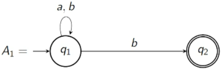

<!-- vscode-markdown-toc -->
* 1. [Example 1](#Example1)
* 2. [Example 2 - Jumps](#Example2-Jumps)
* 3. [Formal Definition](#FormalDefinition)
* 4. [Computations](#Computations)
	* 4.1. [Formal Definition](#FormalDefinition-1)
* 5. [Why NFAs are useful](#WhyNFAsareuseful)
	* 5.1. [Example](#Example)
	* 5.2. [Example 2](#Example2)

<!-- vscode-markdown-toc-config
	numbering=true
	autoSave=true
	/vscode-markdown-toc-config -->
<!-- /vscode-markdown-toc -->

# Non Deterministic Finite Automata (NFA)

In a DFA, given a state and a symbol from a word, the next state is already determined and the same every time.

NFAs are easier to work with because you don't necessarily have to define transitions for every single symbol of the alphabet on every state. This makes it more readable for humans and easier to program.

##  1. Example 1

This DFA is illegal because it has two arrows pointing out of $q_1$ for $b$, and no arrows at all in $q_2$. 

$aab$ can be accepted providing you pick the right path: $q_1 q_1 q_2$.

$aba$ can either be rejected by $q_1 q_1 q_1$ and if it follows $q_1 q_2$ then it is also rejected since the final symbol $a$ cannot be read.

$abbb$ can be accepted by following $q_1 q_1 q_1 q_2$. This can also be rejected by following the wrong path of course.

This is all to say that if there is some computation that leads to an accepting state at the end of a word then the word is accepted.

##  2. Example 2 - Jumps

Remember the letter $e$ always means an empty word and is not a symbol of the alphabet.

From $q_3$, you can either choose to read the $a$ and move to $q_1$ or you can jump to $q_1$ using the empty word and read the $a$ next.

##  3. Formal Definition

The 5 objects remain the same as DFA except $\delta$, which becomes:

- $\Delta \subseteq Q \times (\Sigma \cup \set {e}) \times Q$

The rest stay the same:

- $Q$ is a finite set of states.
- $\Sigma$ is an alphabet.
- $s \in Q$ is the initial state.
- $F \subseteq Q$ is the set of accepting states.

This is known as the transition relation.

$\Delta$ is a subset of all the triples of the states, the alphabet including the empty word and the states again.

This may also be notated by $\delta: Q \times (\Sigma \cup \set {e}) \to P(Q)$

##  4. Computations

One way of computing whether a word is accepted or not is to check all possible paths and if at least one is accepted then the word is accepted.
- This can be a backtracking algorithm

Another method is to parallelise the process; every time there is a choice or branch, split the branch into two threads. If a thread is rejected, delete it.

Let $A = (Q, \Sigma, \Delta, s, F)$ be a NFA. 

Input: A word $w \in \Sigma^*$

1. Start in initial state.
2. Read $w$ from left to right.
3. If two or more transitions are possible, split into one thread for each and continue computation
- If no transition is possible, kill the thread.
4. Accept if any thread is accepted, else reject.

###  4.1. Formal Definition

$A$ accepts $w$ if there exists:

1. $y_1, ..., y_n \in \Sigma^* \cup \set {e}$ such that $w = y_1...y_n$
2. a sequence of states $r_0,..., r_n \in Q$

such that:

1. $r_0 = s$
2. $(r_i, y_{i+1}, r_{i+1}) \in \Delta$ for $i=0,...,n-1$
3. $r_n \in F$

##  5. Why NFAs are useful

###  5.1. Example

Let $L_1$ be a language over $\Sigma^* = \set {0,1}^*$ that has a 1 in the third position from the end.

This would be hard with a DFA because every state must have arrows for both 1 and 2. 

In an NFA, we can have what a in DFA would be a "dead" state to read arbitrary amounts of all symbols, since in this language we don't care about anything except the third to last bit. We also don't need a dead state in a NFA because we can just not have an arrow for certain symbols.

###  5.2. Example 2

If we want a language that accepts binary numbers with even numbers of 0s and/or even number of 1s, we can use the jump:

This creates an or gate that can accept any language from any number of NFAs that we want.
