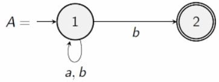
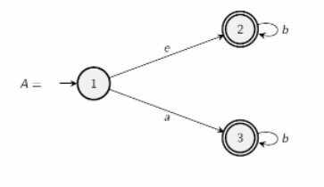
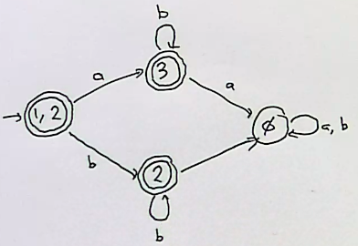

# NFAs vs DFAs

- NFAs are more flexible that DFAs.
  - Usually easier to construct a language using a NFA.
  - Powerful constructions such as or gates.

## Theorem

A language $L$ is accepted by some NFA if and only if it is accepted by some DFA.

So NFAs and DFAs accept the same set of languages.

So any NFA can be converted to a DFA.

## Algorithm - Powerset Construction

Input: a NFA $A$ $\to$ Output: a DFA $A'$ such that $L(A) = L(A')$

### Example 1

Converting the following NFA into a DFA.

This can be described as:

$1 -a\to  1$
$1 -b\to  \set {1,2}$

Let's imagine a new state that is both states $\set {1,2}$.

$\set {1,2} -a\to \set {1}$
$a$ can be read from either state and return to the state $1$.

$\set {1,2} -b\to \set {1,2}$
$b$ can be read from state 1 and move to our new state $\set {1,2}$.

### Example 2 - Jumps

Table representation:

$$
\begin {array} {c|}
& a & b\\
\hline
1,2 & 3 & 2\\
3 & \phi & 3\\
2 & \phi & 2\\
\phi & \phi & \phi\\
\end {array}
$$

- The initial state must be 1 or 2 because the initial jump can mean we can start reading a word from state 2 as well.
- $\phi$ is the empty set, and if we arrive there it is a dead set.
- Any of our new sets of states that contain accepting states also become accepting states.
- 

### General Construction

To transform a NFA $A = (Q, \Sigma, \Delta, s, F)$ to a DFA $A' = (Q', \Sigma, \delta, s', F')$:

1. Jumps
For any $q \in Q$, initially define $E(q) := {q}$.
WHILE there exists $(p, e, r) \in \Delta$ with $p \in E(q)$ and $r \notin E(q)$:
    - DO $E(q) := E(q) \cup \set {r}$
Intuition is E(q) is the set of all states that can be reached from $q$ by jumping along $e$ arrows. So there is a $E(q_n)$ for all $n\leq$ the number of states.

2. Define $A'$ as:
    - $Q' = P(Q)$ the powerset of $Q$.
    - $\Sigma$ is unchanged.
    - $\delta (R, a) := \cup \set {E(q')|(q,a,q') \in \Delta \text { for some } q \in R}$
      - Meaning that $\delta (R, a)$ is the set of all states reachable from $R$ via $a$
    - $s' = E(s)$
    - $F' = \set {R \subseteq Q|R \cap F \neq \empty}$ 
      - The set of all subsets of $Q$ that contain an accepting state.
