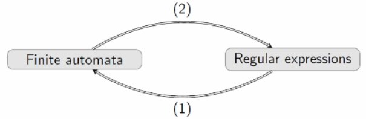
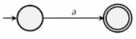
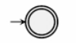
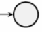

# Regular Expressions

Regular expressions (regex) simply define patterns. For example:

Some zeros, then a 1, then either a zero or a one, then a one. 
- $0^*1(0 \cup 1)1$

Either an empty string, or an even number of ones followed by a zero.
- $e \cup (11)^*0$

## Definition

The set $\text {REG} (\Sigma)$ is a regular expression over the alphabet $\Sigma$ and is defined by:

1. $a \in \text {REG} (\Sigma)$ for any $a \in \Sigma$
    - the $a$ in the regex is itself a regex, but the $a$ in the alphabet is a symbol.
2. $e \in \text {REG} (\Sigma)$
    - again, the $e$ is a piece of syntax in the regex.
3. $\empty \in \text {REG} (\Sigma)$
4. $(\alpha \cup \beta) \in \text {REG} (\Sigma)$ for any $\alpha, \beta \in \text {REG} (\Sigma)$
5. $(\alpha \beta) \in \text {REG} (\Sigma)$ for any $\alpha, \beta \in \text {REG} (\Sigma)$
6. $(\alpha^*) \in \text {REG} (\Sigma)$ for any $\alpha \in \text {REG} (\Sigma)$

In writing, $^*$ binds closer than concatenation, which binds closer than $\cup$. So $ab \cup ab^* = ((a(b)) \cup (a(b^*)))$.

## The language associated with regex

Any regular expression $\alpha \in \text {REG} (\Sigma)$ represents a language $L(\alpha) \subseteq \Sigma ^*$:

1. $L(a) = \set {a}$
2. $L(e) = \set {e}$
3. $L(\empty) = \empty$ (empty language)
4. $L(\alpha \cup \beta) = L(\alpha) \cup L(\beta) = \set {\alpha, \beta}$
5. $L(\alpha\beta) = L(\alpha)L(\beta) = \set {\alpha} \set {\beta}$
5. $L(\alpha^*) = L(\alpha)^*  = \set {\alpha}^* = \set {e, \alpha, \alpha\alpha,...}$

### Examples

$L(ab^* \cup b^*a)$
- $abbbbbbbb...$ or $baaaaaa...$

- $L((b \cup ab^*a)^*)$

## Theorem

Regular languages are exactly those that can be represented using regular expressions. 

It suffices to show two things:
1. For any regular expression $\alpha$ the language $L(\alpha)$ is accepted by some DFA/NFA. 
2. For any regular language $L$ accepted by some DFA/NFA, there is a regular expression $\alpha$ that represents $L$. 

### Regex to Finite Automaton

1. $L(a) = \set {a}$ is accepted by:

2. $L(e) = \set {e}$ is accepted by:

3. $L(\empty) = \empty$ is accepted by:

4. For $L(\alpha \cup \beta), L(\alpha\beta), L(\alpha^*)$ we use the closure properties of regular languages to prove. 