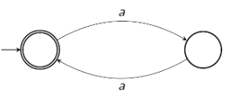
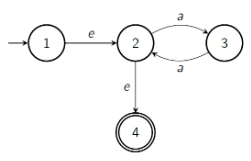
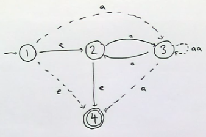
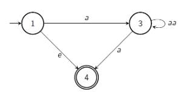
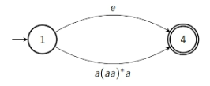
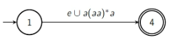
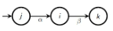

# Converting Finite Automata to Regex

## Example 

This DFA accepts an even number of $a$s. The regex that corresponds is $(aa)^*$. But to apply the algorithm:

### Preprocess stage

Introduce a new initial state, and a new accepting state from the current accepting states. These states have the properties that the initial state only has one outgoing arrow, and the accepting states have only one incoming arrow. 

Our goal is to eliminate the old states.

### Main loop

Here, we want to add bypass arrows so that we can avoid certain states. But the bypass arrows must produce exactly the same result as going through that state. To eliminate state 2, we must create bypasses to represent:

$1 \to 2 \to 3$
$1 \to 2 \to 4$
$3 \to 2 \to 3$
$3 \to 2 \to 4$

Notice that in state 3, we have a need to introduce more complex labels for the arrow - namely the regular expression $aa$. 

Now that we have bypasses for all states through 2, we can remove it.

Repeating the above process with state 3, we want to bypass only $1 \to 3 \to 4$. So our new label for $1 \to 4$ is $a(aa)^*a$. Our new automaton is:

Which we can simplify to:

## Formal Description

1. Input DFA/NFA
2. Pre-process
3. Main procedure
    - arrows are labelled by regex
    - there is at most one arrow going between any two states
    - the initial state has no incoming arrows
    - the accepting state has no outgoing arrows
    - the generalised NFA accepts the same language as the original automaton.

### Pre Processing

1. If the accepting state has outgoing arrows, or there is more than one, create a new one with only incoming jumps from the accepting states. Make old accepting states non accepting.
2. If initial state has incoming arrows, make a new initial state with jump arrow to old one.
3. Label states $1,2,...,n$ where $1$ is initial and $n$ is accepting.
4. If any pair of states have more than one arrow between then, merge then using the $\cup$ operator.

### Main Procedure

for $i = 2, 3, ..., n - 1$ do:
- for all $j,k \neq i$ such that there is a path 

    - do the following:
        1. If there is no loop from $i$ to itself, add a new arrow from $j$ to $k$ labelled $\alpha \beta$.
        2. If there is a loop from $i$ to itself labelled $\gamma$, add a new arrow from $j$ to $k$ labelled $\alpha \gamma^* \beta$.
        3. If there are now two arrows from $j$ to $k$ labelled $\alpha_1, \alpha_2$, merge them into a single arrow $\alpha_1 \cup \alpha_2$.

Remove state $i$ and all arrows connected to it.