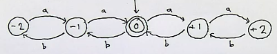
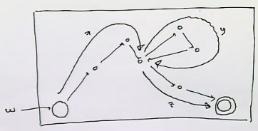
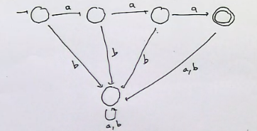
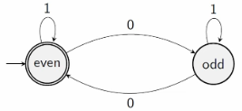

# The Pumping Lemma

Could you create a finite automaton such that, over a language $L \subseteq \set {a,b}^*$ each word contains an equal number of $a$s and $b$s? 

This shows that you would be an infinite number of states, so this is impossible in a *finite* state machine.

So this language $L$ is not a regular language, because arithmetic and complex counting is required. 

The pumping lemma proves this for non regular languages. 

## Idea

Find a special property that all regular languages have and show that non regular languages do not have this property.

Consider the properties "is regular", $R$, and "can be pumped", $P$. Being pumped is a looping property. These properties have the relationship $R \subset P$, so proving that a language cannot be pumped means it is certainly not a regular language.

Our property is that *all sufficiently long words can be pumped*.

## Pumping

Suppose a DFA has $n$ states. If a word $w$ with length $l \geq n$, the path must follow a loop and visit at least one state multiple times. 

In this example, the word $w$ can be represented as $xyz$. $x$ is the part before the loop, $y$ is the loop, and $z$ is the part after.

$w = xyz \in L$

This means that $xz, xyyz, xyyyz, ... \in L$
- This is pumping!

The pumping lemma is this formation without reference to finite automata, because we want to show a language cannot be represented as a finite automaton. 

Pumping happens in **any regular language**, for any word with length greater than or equal to the number of states in the DFA that represents it.

You **cannot** use the pumping lemma to show that a language is regular, since $R \subset P$.

### Non pumpable languages

In this DFA, there are no loops so no pumping occurs, but since no accepted words are sufficiently long (i.e. $l < n$) it doesn't break the lemma. 

### Pumping Example

Any word with length greater than or equal to 2 should be pumpable:

$1100 = xy$, where $x$ and $y$ can be both be pumped. 

Notice that there is always a loop within the first $n$ letters, because there are only $n$ states so a loop has to occur. So for a word to be pumpable the looping must happen in the first $n$ letters. ($n$ is the number of states)

## Informal Definition

Let $L$ be a regular language. Then there is a special number $n$ called the pumping length, such that any word $w$ with $|w| \geq n$:
1. contains a non empty loop
2. the loop can be found in the first $n$ letters of the word
3. the loop can be pumped an arbitrary number of times and we still have a word in $L$. 

## Formal Definition

Let $L$ be a regular language. Then there is a special number $n$ called the pumping length, such that any word $w$ with $|w| \geq n$ can be divided into three pieces, $w = xyz$ such that:
1. $y \neq e$
2. $|xy| \leq n$
3. $xy^i \in L$ for all $i = 0,1,2,...$