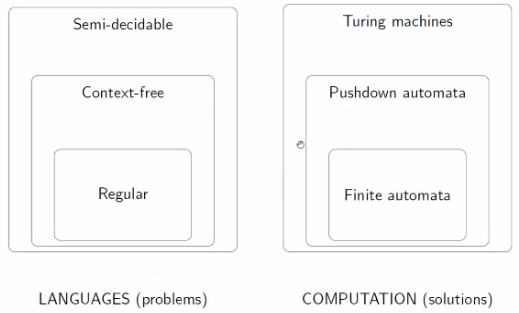
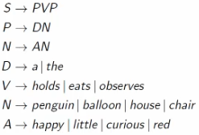
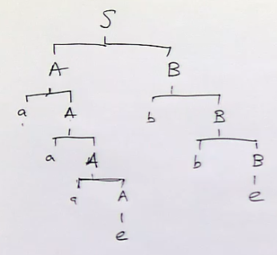

# Context Free Grammars

## Simple formal grammar example

Using these rules, we can make sentences that follow simple grammatical rules. Deriving a sentence in this language can be done by applying the rules to manipulate variables until they all reach terminals (e.g. "happy"). 

## Using context free grammars to define Regular Languages

Consider the following grammar $G$:

$$
S \to AB\\
A \to aA|e\\
B \to bB|e\\
$$

This derived sentence is $aaabb$. 

$$L(G) = \set {a^nb^m | m,n \geq 0}$$

Another grammar:

$$
S \to aSb|e
$$

This language is represented by $L(G) = \set {a^nb^n | n \geq 0}$. This is not regular, and can be disproved by the pumping lemma. 

## Formal Definition

A CFG is given by the tuple $G = (\Sigma, V, R, S)$ where:

- $\Sigma$ is an alphabet called the **terminals**.
- $V$ is an alphabet called the **variables**, $\Sigma \cap V = \empty$
- $R \subseteq V \times (\Sigma \cup V)^*$ is a finite set of rules. 
    - Rules has the form $(A,w)$ where $A$ is a variable and $w$ is a word made out of variables and terminals. It is also written $A \to w$.
- $S \in V$ is the **start variable**.

### Example

$G$ is defined by:

$$
S \to AB\\
A \to aA|e\\
B \to bB|e\\
$$

This can be formally described as:

$$
\Sigma = \set {a,b}\\
V = \set {S, A, B}\\
R = \set {(S, AB), (A, aA), (A, e), (B, bB), (B, e)}\\
S = AB
$$

## Derivations in CFGs

Suppose there are two words $u,v$ over $\Sigma \cup V$.

We say that v is derivable from u in one step ($u \implies v$)if:
- $u = xAy$ for $x,y \in (\Sigma \cup V)^*$ and $A \in V$
- $v = xzy$ for $z \in (\Sigma \cup V)^*$
- $A \to z$ is a rule in the grammar $G$.

## Context free languages

For any CFG $G$, we have a language $L(G) \subseteq \Sigma ^*$:

$$L(G) := \set {w \in \Sigma ^* | S \implies\ ^* w}$$