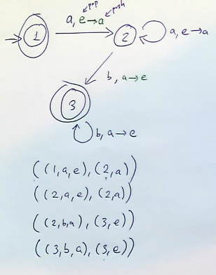

# Pushdown Automata

What if we tried to make an automata for languages that aren't regular?

## Example

$$L = \set {a^nb^n | n \geq 0}$$

This automata has a repeating but infinite structure. 

We could add a "memory" to our automata to remember which part of the infinite structure we are in. For example:

In this NFA, we have compulsory memory instructions on each path. We also must define that in order for a word to be accepted, the memory stack must be empty (equal number of $a$s and $b$s).

This type of automaton is called a Pushdown Automaton (PDA). 

## Summary of PDAs

- PDAs are finite automata with added stack memory.
- Adding stack gives us a model of computation powerful enough to describe context free languages. 
- The language accepted by any PDA can be described by a context free grammar. 

## Formal Definition

A PDA consists of six objects: $(Q, \Sigma, Г, s, \Delta, F)$, where:
- $Q$ is a finite set of states.
- $\Sigma$ is the input alphabet.
- $Г$ is the stack alphabet. 
- $s \in Q$ is the initial state.
- $F \subseteq Q$ is the set of accepting states.
- $\Delta \subseteq (Q \times (\Sigma \cup \set {e} \times Г^*) \times (Q \times Г^*))$ is the transition relation.

There are lots of different but equivalent PDAs.

### Transitions

Recall that in an NFA, the transitions are:

$$\Delta \subseteq Q \times (\Sigma \cup \set {e}) \times Q$$

Which is a triple (current state, transition symbol, next state).

A PDA's transitions $\Delta \subseteq (Q \times (\Sigma \cup \set {e} \times Г^*) \times (Q \times Г^*))$ must contain popping and pushing to the stack. The tuple for PDA becomes:
((current state, transition symbol, pop from stack), (next state, push to stack))

The instruction may be popping or pushing the empty word. 

#### Example

Looking at this example, this is how we use the tuple notation for transitioning from 1 to 2.

$$((1, a, e), (2, a))$$

So we pop nothing and the push an $a$ to the stack. 

## Computations in PDAs

Let a PDA $A = (Q, \Sigma, Г, s, \Delta, F)$.

1. A triple $(p, w, \gamma) \in Q \times \Sigma ^* \times Г^*$ is called a configuration of $A$. 
    - A configuration represents the current state, the rest of the word we still have to read, and the content of the stack.
2. A configuration $(p, av, \gamma)$ yields $(q, v, \delta)$ if there is a transition such that:
    - $\gamma = \alpha \theta$
    - $\delta = \beta \theta$
    - $((p, a, \alpha), (q, \beta)) \in \Delta$
    - This is to say that the $\alpha$ is popped from the stack which already contains $\theta$, and a $\beta$ is pushed onto it.
3. If $C_1, ..., C_n$ are configurations such that $C_i$ yields $C_{i+1}$ in one step for all $0 < i < n$, we say that $C_1$ yields $C_n$. 

We say that a PDA accepts a word if $(s, w, e)$ yields $(q, e, e)$ for some $q \in F$. The language accepted by this is $L(A)$. 

## Example

We use this arrow notation to show pops followed by pushes.