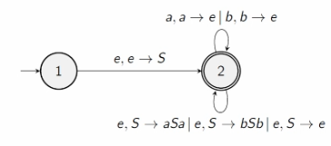
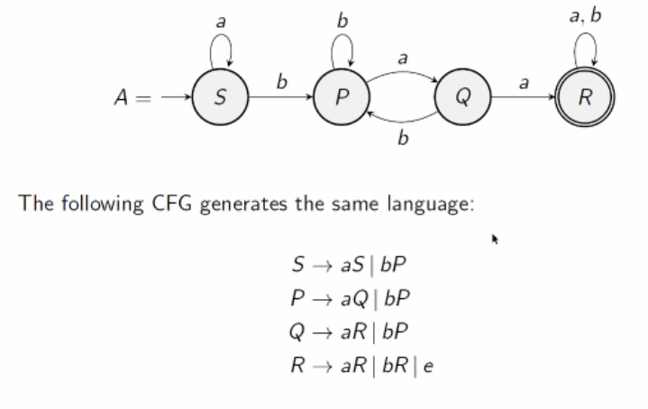
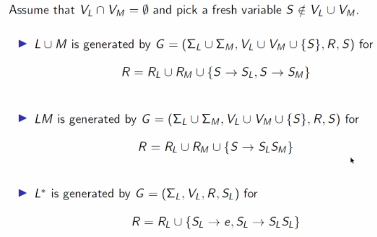

# Context Free Grammars to Pushdown Automata

Let $G = (\Sigma, V, R, S)$ by a CFG. Let a PDA $A = (Q, \Sigma, Г, s, \Delta, F)$ as follows:

- $Q = \set {1,2}$
- $Г = \Sigma \cup V$
    - The memory is the variables *and* the terminals.
- $s=1$, $F=\set{2}$
- $\Delta$ given by:
    - $((1,e,e),(2,S))$ 
        - we start by pushing the S from our CFG onto the stack
    - $((2,e,X),(2,w))$ for each $X \to w$ in $R$.
        - this decomposes the words made up of larger variables, for example $S$.
    - $((2,a,a),(2,e))$ for each $a \in \Sigma$.
        - for every terminal, add a loop that pops the terminal from the stack.

## Example: $\set{ww^R | w \in \set {a,b}^*}$

Pallindromic words. 

*side note: CFGs are context free because you can choose to use any variable you want without considering what the other variables are.*

Simply choose the correct path.

## DFA to CFG

Let a DFA $A = (Q, \Sigma, \delta, s, F)$, a CFG $G = (\Sigma, V, R, s)$ as follows:

- $V$ is the set of states of $A$. The variables are the states in the DFA.
- $s$ is the initial state of $A$
- $R$ is given by:
    - $P \to aQ$ if $\delta (P, a) = Q$
    - $P \to e$ if $P \in F$.
        - At the accepting state, in a CFG, you need to be able to get rid of the variable so you need to be able to replace it with a $e$. 

Then $L(A) = L(G)$. 

### Example

## Closure Properties of context free languages

Let $L$ and $M$ be CF languages. Then:
- $L \cup M$
    - use a new initial state with jumps to their respective PDAs. 
- $LM$
    - jumps from final states of $L$ to initial state of $M$. 
- $L^*$
    - jumps from final states to initial state. 

are all also CF languages.

This is how they would be defined in terms of CFG instead of PDAs:

