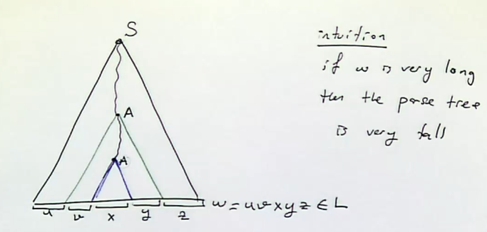

# Pumping Lemma for CFL

Note: All lecture notes available online, on moodle

## Regular Lanuages

You can find a finite automaton that accepts any regular language.

But for a language like $\set {a^nb^n | n \geq 0}$, there is no finite automaton, because you require infinitely many sets. This language can be pumped, so it is a context free language, which can be accepted by a pushdown automaton. 

CFG to accept this language: 
$$
S \to aSb|e
$$

What about $\set {a^nb^nc^n | n \geq 0}$?

Turns out this language is not context free.

### Pumping lemma for CFL

1. Assume $L$ is context free.
2. Find an example of a word that cannot be pumped.
3. Contradiction
4. Therefore $L$ is not context free. 

In the pumping lemma for finite automata, we find a loop in the states and pump it. With CFL, we can find a loop in variables, ie. $A \to B, B \to C, C \to A$.

If the parse tree becomes sufficiently large, then variables must be reused to account for the length, since there are finite variables. 

We can use this to split the word $w$ into 5 parts, pictured. From the higher $A$, we could replace the blue parse tree with the larger green triangle. Pumping! Therefore we can replace $x$ with $vxy$, which is recursive. If we pump once, we get

$$w' = uv^2xy^2z$$

We can keep doing this to get 

$$w'^{n} = uv^nxy^nz$$

You can also pump backwards to $n=0$ by replacing the larger $A$ parse tree with the smaller $A$ triangle, to get $w' = uxz$.

#### Formal

In any CFL, there is a number $n$ called the pumping length, such that any word $w \in L$ with $|w| \geq n$ can be divided into $w = uvxyz$ such that:

1. either $v \neq e$ or $y \neq e$
    - meaning if both are empty, then pumping just produces the same word.
2. $|vxy| \leq n$
3. $uv^ixy^iz \in L \forall i=0,1,2,..$

#### General Strategy

1. Suppose language is context free: there is some $n > 0$ such that all words $w \in L$ with $|w| \geq n$ can be pumped.
2.  Make a clever choice of work with $|w| \geq n$. This must work for any value of $n$. 
3. There is some $w = uvxyz$, that follows the pumping lemma rules
4. For any such division, try to find a word that contradicts one of these rules
5. Contradiction found, therefore the language is not context free. 

### Corollary

Intersection and complements of CFL are not under closure properties, ie. they do not necessarily produce another CFL under these operations. 