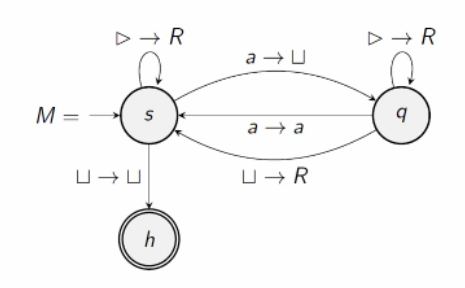

# Turing Machines

PDAs are NFAs with stack memory; you can only access items from the top of the stack and the memory always starts empty. This changes with turing machines.

- Unsolvability of the halting problem: does the computation enter an infinite loop? If yes, it is unsolvable

The turing machine has tape memory, has full computing power and cannot solve the halting problem.

## Construction of a Turing Machine

- The **head**: points to the position in tape memory.
    - holds the state and position in memory.
    - the state of the head and the item in memory decide what happens next, either move left, right or change what is written in the current cell. 
- The **tape**: the infinite memory that is made up of discrete cells, does not continue to left but infinitely to the right.

### Turing Machine as a State Diagram

$R$ is right, $L$ is left, empty box is empty out memory, triangle is start, and $a$ is a symbol in the memory tape.

### Definition

A TM consists of six objects: $(Q, \Sigma, \Sigma _0, s, \delta, H)$ where:

- $Q$ is a finite set of states.
- $\Sigma$ is the tape alphabet that must contain the empty memory, start symbol and must not contain L,R. 
- $\Sigma_0 = \Sigma \backslash \set {\triangle, \sqcup}$ is the input alphabet.
- $s$ is the initial state.
- $H \subseteq Q$ are the halting states.
- $\delta: (Q \backslash H) \times \Sigma \to Q \times (\Sigma \cup \set {L,R})$ is the transition function.

### Configuration

The configuration is how the TM starts. It is defined as a tuple $(q,u,a,v)$ where $q \in Q$, $u, v \in \Sigma ^*$, and $a \in \Sigma$ such that uav is a word starting with $\triangle$. 

A TM halts on a word if there is a sequence of configurations that ends with $q \in H$. 

### Language

A language is called **semidecidable** if there is a TM with input alphabet $\Sigma _0$ such that if $w \in L$ then the TM halts on it, and if $w \notin L$ then the TM doesn't halt on it. 

A language is called **decidable** if the TM halts a state $Y$ if $w \in L$, and the TM halts on a state $N$ if $w \notin L$. 

$L$ is decidable iff $L$ and $\Sigma ^* _0 \backslash L$ are semidecidable. 