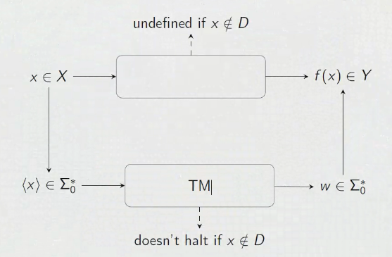

# Algorithms and the Church-Turing Thesis

Algorithms give rise to functions: $f: X \mapsto Y$

Functions whose outputs can be computed by an algorithm are called effectively calculable. 

## Partial Functions

$f: D \subseteq X \mapsto Y$

If $x \in D$, then $f(x) \in Y$, otherwise if $x \notin D$, then $f(x)$ is undefined. $D$ is the domain on which $f$ is defined.

For example: $s: \mathbb {R} \times \mathbb {R} \mapsto \mathbb {R}$ for $s(x,y) = z$ iff $\frac {x} {y} = z$. So the domain $D = \set {x,y | y \neq 0}$

### Turing machines with partial functions

If an input to an algorithm in a TM is undefined, the TM never halts. 

Given a set of inputs $x \in X$, create a suitable tape language for the tape memory for the inputs. This is noted as $\langle x \rangle \in \Sigma _0 ^*$. This code $\langle x \rangle$ is now in the tape and fed into the TM. If it halts, then the word left at the end $w \in \Sigma _0 ^*$ is the output. 

The domain is all the $x$ inputs that halt. 

### Computable functions

Let $f: D \subseteq \Sigma _0 ^* \mapsto \Sigma _0 ^*$ be a partial function. $f$ is computable if there exists a TM $M$ such that:

- if $w \in D$ then $M$ halts on $w$ with $f(w)$ written on the tape.
- if $w \notin D$ then $M$ doesn't halt on $w$.

*We always assume that any finite input can be coded into a suitable alphabet.*

## Church Turing Thesis

The thesis is that algorithms and TMs are synonymous. A function is effectively calculable iff it can be implemented on a TM.

There are three ways to define a TM:

1. Formal definition: state diagram, alphabets etc.
    - necessary for formal proofs
    - required for implementing a TM on a computer
2. Implementation level description: use natural language to describe how the head moves and interacts with the tape. 
    - good for when full details aren't required, but aspects of computation are relevant such as complexity: number of steps to halt.
3. High level description: uses Church Turing thesis. Just describe the algorithm, and the details of the head and tape are omitted. 

*Decidable languages halt in "yes" and "no" states, while semi-decidable languages halt in "yes" states and don't halt for words not in the language.*