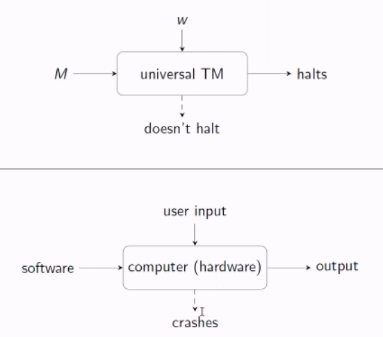

# Universal Turing Machine

The languages created by DFAs and NFAs are decidable. We can create a code $\langle A, w \rangle$ for an DFA $A$ and a word $w$ that halts on a "yes" state for the DFA's accepting states, and a "no" state if not. NFAs can be converted to DFAs so they are also decidable. 

Regex is also decidable. This is because we can create NFAs to model a regular expression, which can be converted to a DFA.

Using TMs to compute TMs. TMs are semi-decidable, you simply place the contents of a TM into another TM, and it will do what the inner TMs instructions say.
- This is called a universal Turing Machine.

You can nest as many TMs inside of another TM as you want. 

## Computers as Universal Turing Machines

## Undecidability of the Halting Problem

*Proof by contradiction.* Assume that a Turing machine $M_0$ can decide whether another Turing machine $M$ halts or not. 

try to understand the self referential paradox

