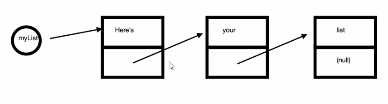

# Variable-size Data Collections

## Data collections

We have used arrays so far - they are good but fixed in size.

- Sets - any order.
- Bags - any order.
- Stacks - last in first out.
- Queues - first in first out.

are all dynamic. 

### An API for collections

Operations our collections must support:

1. `add(item)`
2. `get()`
3. `isEmpty()`

### Linked List

Each item has a value and a pointer to the next item.

### Resizable Arrays

- Have a fixed capacity
- Always uses the same amount of memory

What if we just make a new bigger array every time we run out of space?
- Have to move all items to the new array - complexity penalty.

### Amortized Complexity

The `add()` operation is constant until the resize occurs, in which case it is $O(n)$. For example:

For 1001 add operations, you have to move $100 + 200 + 300 + ... + 1000$ items. Which is $O(n^2)$, over $n$ operations, so the average or Amortized complexity is $O(n)$.