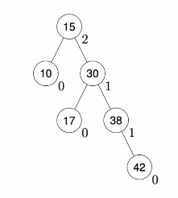

# Trees as Data Structures

## Binary Search Tree

- Each node is associated with a **key**
- The keys in the left subtree of any node are all **smaller** than the root's key
- The keys in the right subtree of any node are all **larger** than the root's key
- In order traversal visits the nodes in order of smallest to largest keys.

### BST Search

Recursively:

1. Look at root
2. If the search key is smaller, start again in the left subtree
3. If the search key is larger, start again in the right subtree

## BST Insert

Same as search to find the insertion location, then create a new leaf node with the new key. 

### BST Delete

If you delete a root node of a tree, you can swap in either the **predecessor** (the rightmost node on the left subtree) or the **successor** (the leftmost node on the left subtree) as the new root. This is done recursively to fix the tree. Deleting leaf nodes is simply removing it from the tree.

### Complexity

Complexity of all these operations is $O(\text{height of tree})$

The height of tree is optimal when the tree is **balanced**, giving $O(\log n)$. If a tree is perfectly unbalanced, then the height of the tree is $n$, so the complexity is $O(n)$, like a linked list. 

## Self Balancing trees: AVL trees

The balance factor of a tree is $\text{height}(\text{left subtree}) - \text{height}(\text{right subtree})$

This BST has been annotated with the BF at each node. If the BF is small everywhere, i.e. 0, then the height is $O(\log n)$. But most trees cannot have a BF of 0 everywhere.

**Fact**: there exists a tree for any $n$ nodes such that all BF values are $-1,0$ or $1$.

An AVL tree is a BST where every BF value is -1, 0, or 1. So all operations have complexity $O(\log n)$.

### Rebalancing

**Left rotation**. If a tree is "right right" unbalanced, then "rotate" the three nodes (root, right child of root, and right child of the right child) anticlockwise. Then reattach all of the subtrees such that inorder traversal is preserved. 

Same for the left left unbalanced, reversed.

**Double left rotation**.For a "right left" unbalanced tree, right rotate the left child of the right child, then perform left rotation on the root node.

Same for left right unbalanced, reversed. 

