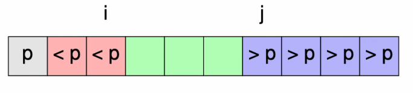

# Treesort

Sorting is just putting elements in order in the tree.
- Stable sort is when two elements with the same key are put in the tree in the same order such that on retrieval they appear in the same order as the order they were put in.
- After creating the tree, perform in-order traversal to get sorted list.

We can argue that this sort is correct using an invariant:
- (1) The elements in $C \cup t$ are the same as the elements in $C$
- The inorder traversal of $t$ is sorted. 

```python
def sort(C)
    t = BST()
    while len(C):
        # (1) becomes false here
        x = C.pop(0)
        # (1) becomes true here again - loop invariant true
        t.insert(x)
    # (2) becomes true as long as the BST is correct
    return t.inorder()
```

So if the loop terminates, we have a sorted list. But the invariant doesn't specify whether the loop terminates or not, so it is partially correct. The termination part is difficult because of the halting problem.

## Complexity 

Worst case: $O(n^2)$
Average case: $O(n\log n)$
Self balancing tree: $O(n\log n)$

### Quicksort

1. Choose an element $p$ of the array - the pivot element.
2. Partition the array so that every element smaller than $p$ is to the left and everything bigger is to the right of it
3. Do this recursively on each subarray




From $i$, scan right until a $>p$ is found. Then scan left from $j$ until a $<p$ is found. Swap the two elements. Repeat until $i$ and $j$ swap over. Finally, swap $p$ with the element in the $j$th position. This means $p$ is in its final sorted position. 

## Complexity 

Worst case: $O(n^2)$
Average case: $O(n\log n)$