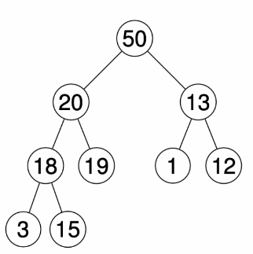
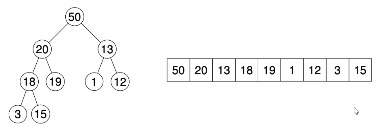

# Heaps

## Priority Queue

- `insert` - insert with given priority
- `getMax` - get item with highest priority
- `deleteMax`
- `isEmpty`
- `increaseKey`

## Heaps

Using heaps over BST reduces overhead and can be implemented in an array.

- A **max heap** is a *complete* binary tree with the max-heap property:
    - every node is larger than all the nodes in its subtrees.
- Complete means all rows are filled except (maybe) the bottom row

Heap operations:
- `getMax` - return node at root
- `deleteMax`
    - Find the rightmost item in final row doing a breadth first search and replace it as the root.
    - *Sift* through the tree, swapping the new root with the highest priority of its children.
- `insert`
    - Add in the new child at the bottom row at the rightmost position.
    - Sift upwards - swap with its parent until its parent is higher priority than it.

These are $O(n \log n)$ algorithms.

To make a heap with $m$ elements is linear time: $\Theta (m)$.

### As an Array

The heap can be represented in an array as its in order traversal.
- in order traversal is just left to right, top to bottom.

Indices line up nicely:
- children of node $n$ are $2n+1$ and $2n+2$ 
- parent of a node is $\lfloor(n-1)/2 \rfloor$

This is called a heap ordered array.