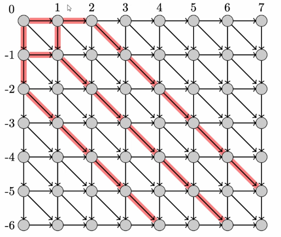

# `diff`

Copmutes the difference between file $A$ and $B$. Specifically, the sequence of edits that requires the minimal number of edits. 

An edit (for simplicity) is either:
- adding a new line
- deleting an old line

An edit sequence is a sequence of instructions of the form:
- $I$ $n$ $a_1, ..., a_k$ - inserting $a_1, ..., a_k$ after element $n$
- $D$ $n$ - deleting element $n$

## Example

Sequence `A = xyzz`

Performing the following instructions:
- `D1 I3xy D2` yields `B = zxyz`

## Analysis

Length of `A`: $l_1$
Length of `B`: $l_2$
Let $d$ be the number of deletions and $i$ be the number of insertions.

$l_1 - d = l_2 - i$

Also, the common subsequence between the two files is 

$$2c = l_1 + l_2 - (d + i)$$

i.e. the only difference between $l_1$ and $l_2$ is the deletions and the insertsions. 

Minimising $d+i$ corresponds to maximising $c$.

### Longest Common Subsequence

1. Look at the last two elements $a_m$ and $b_n$. If they are both the same, include them in the LCS. Then restart from the rest of the two words.
2. Otherwise, at least one of $a_m$ and $b_n$ is NOT in the LCS. So search the rest of each recursively:
    - LCS of $a_1 ... a_{m-1}$ and $b_1 ... b_n$
    - LCS of $a_1 ... a_m$ and $b_1 ... b_{n-1}$

Let $l(i,j)$ be the length of the LCS of $a$ and $b$.

We get a Bellman equation:

$$
l(i,j) = 
\begin{cases}
0 & \text{if } i = 0 \text{ or } j = 0\\
1 + l(i-1, j-1) & \text{if } a_i = b_j\\
\max(l(i-1, j), l(i, j-1)) & \text{otherwise}
\end{cases}
$$

Computing this naively is very slow, but storing the computations in a lookup table makes the program must faster. 

This is $\Theta(mn)$.

However, in large files we are going to be looking for only a few small differences. So we optimise for this. 

## `diff` as a graph problem

Horizontal edge means deleting a line in the original file, vertical edges are inserting a line from the new file, and the diagonal lines are keep the original element because they are common. 

(ignore red node)

We are looking for the shortest route from the top left node to the bottom right node. The horizontal and vertical edges have a cost of 1 and the diagonal edges cost 0. This becomes a shortest path algorithm!

We could use Dijkstra to calculate the shortest path. The complexity on this graph is $\Theta (|V| \log |V|)$, which is worse than $\Theta(mn)$.

We can use the bucket queue implementation, which reduces the complexity to $\Theta (|V|)$.

Since we assume the number of diagonal edges is large, we can edit our approach. 

If the minimum edit sequence has length $D$, when we reach the bottom right of the graph we will have visited at most $2D + 1$ diagonals.

This algorithm uses a greedy strategy - always take a diagonal edge. 

The new complexity is $\Theta(\min(m,n)D$, where $D$ is the number of edits.