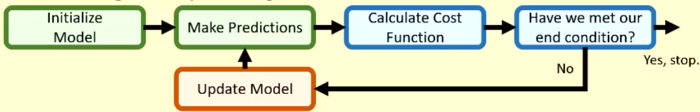

# Supervised learning

- Supervised learning
    - learning through examples
- Unsupervised learning
    - learning through data structure
- Reinforcement learning
    - learning through trial and error

## Creating a model

1. Choose either a parametric or non-parametric models.
2. Choose a cost function.
3. Choose an optimizer.

This is the usual training loop:

## Linear Regression

- Aims to predict continuous values
- Tries to find a line of best fit through data

The model tries to optimize a hypothesis function:

$$h_{\theta} (x)= \theta _0 + \theta _1 x$$

This function is a single dimension input to output.

$\theta _0$ is the bias.

### Vectorise hypothesis function

Turn our feature set into a 1d vector:

$$
x = [1, x_1, x_2] ^ T\\
\theta = [\theta _0, \theta _1, \theta _2] ^ T
$$

We have a single 1 in the x matrix to account for the bias term when multiplying.

So $h_\theta (x) = \sum \theta^T x$

We sum because we add all of the terms together after multiplying by the $\theta$ vector.

### Cost

The cost function in linear regression is a variation of mean square error:

$$
\frac {1} {2m} \sum \limits _{i=1} ^{m} (h_\theta (x^i) - y^i)^2
$$

We use the $\frac {1} {2m}$ to make the derivative easier.

The super script $i$ refers to the row of the table.

### Optmization

Linear regression uses iterative gradient descent.

Our cost function is:

$$
J(\theta) = \frac {1} {2m} \sum \limits _{i=1} ^{m} (h_\theta (x^i) - y^i)^2
$$

So our new updated parameters are:

$$
\theta _j = \theta _j - \alpha \frac {\partial J(\theta)} {\partial \theta _h}
$$

$\alpha$ is the learning rate. The derivative is the derivative of the cost function with respect to the parameter being updated. We subtract the gradient to step down towards a lower cost function.

#### Calculating the derivative

$$
\frac {\partial J(\theta)} {\partial \theta _j} = 
\frac {\partial} {\partial \theta _j} (\frac {1} {2m} \sum \limits _{i=1} ^{m} (h_\theta (x^i) - y^i)^2)\\
= \frac {1} {m} \sum \limits _{i=1} ^{m} (h_\theta (x^i) - y^i)x_i ^j
$$

The derivative simplifies to this sum.