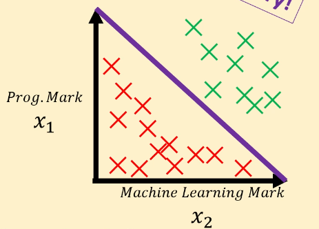

# Logistic Regression

## Classification

Classification is distinguishing between two or more classes.

1. Multi class
    - Classifying inputs into one class
2. Multi label
    - Labelling inputs with one or more labels

## Model and hypothesis

### Logistic (sigmoid) function

$$
\sigma (x) = \frac {1} {1 + e^{-x}}
$$

Originally in linear regression our hypothesis function was $h_\theta (x) = \theta^T x$. We can apply the logistic function to this to obtain a logistic regression hypothesis function:

$$h_\theta (x) = \sigma(\theta^T x)$$

Since the sigmoid gives a value between 0 and 1, we can interpret the new hypothesis function as the probability that the features map to a label.

We can set a threshold (e.g. 0.5) to create a binary classifier.

### Example

If we set the $\theta = [-100, 1, 1]^T$ then $y = \sigma (-100 + x_1 + x_2)$, where $y$ is the label. For anything above the boundary, $-100 + x_1 + x_2 > 0$, whereas for anything below $-100 + x_1 + x_2 < 0$. 

This means that applying the logistic function will return $>0.5$ to classify the green points and $<0.5$ to classify the red points.

We are doing linear regression on the decision boundary. (trying to fit a line to the decision boundary)

## Decision boundaries

They are very sensitive. Sometimes a straight line isn't enough to classify more complicated data. This is called a "non-linearly separable" problem.

To increase the complexity of the hypothesis function we increase the order of the polynomial used in the function.

## Cost function

We cannot use MSE for logistic regression because the gradients obtained when using the sigmoid function are non-convex. This is because the classification is binary, so the model is either correct or not, meaning gradients are 0.

### Log Loss function

$$
J(\theta) = -[y \log(h_\theta(x)) + (1-y)\log(1 - h_\theta(x))]
$$

The term $y \log(h_\theta(x))$ takes precedence when the true value of $y$ is 1, whereas the term $(1-y)\log(1 - h_\theta(x))$ takes precedence when the true value is 0. Remember $\log(x<1)$ is negative, and $\log(1)=0$.

Generalised for all features:

$$
J(\theta) = \sum \limits _{i=1} ^{m}-[y^i \log(h_\theta(x^i)) + (1-y^i)\log(1 - h_\theta(x^i))]
$$

## Multi class

You can create multiple logistic regression models for each label you want to classify.

Each line is a separate model. The model that predicts the highest hypothesis value is chosen as the label.

### Multi label

The three hypothesis outputs may be $[0.74, 0.56, 0.05]$. If any of the values are above 0.5 (or whatever the threshold), we label the features with that output. So in this example the first 2 labels will be predicted true.