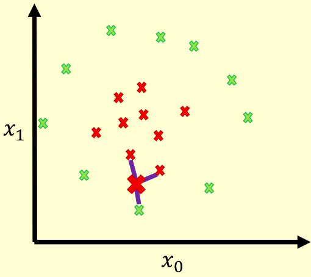
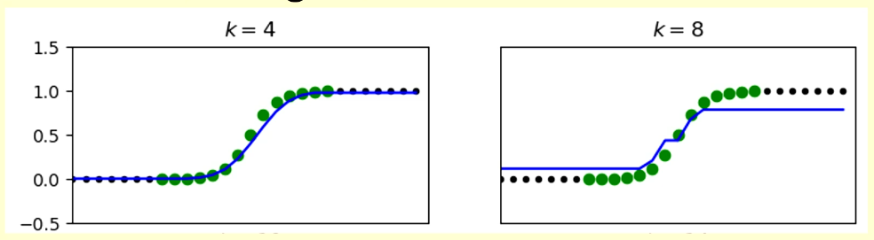
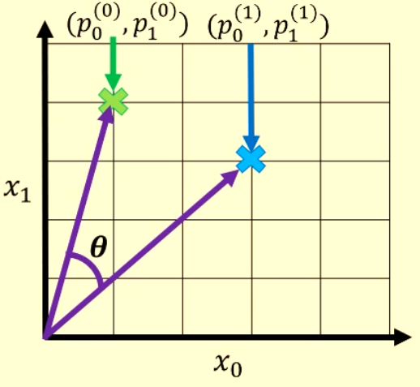
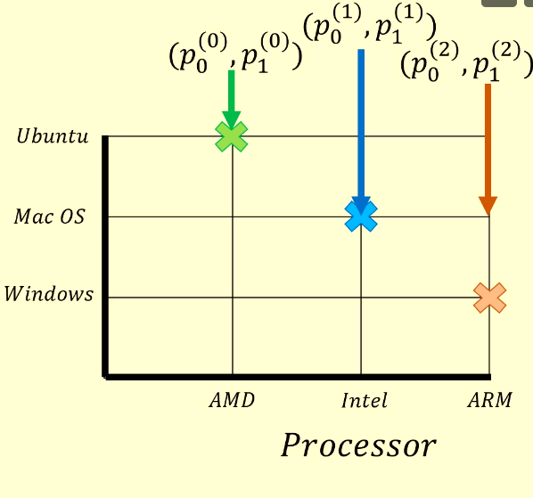

# K Nearest Neighbours (KNN)

KNN is a non-parametric model. It has no parameters that are optimised. You still need training data to make predictions.

KNN allows you to fit to more complex data without using large order polynomials to create complex decision boundaries like with logistic regression.

In this example, $k=3$ is used and the new point is classified as red.

## Regression with KNN

To perform regression, we take the output values $y$ of the $k$ nearest points and average them. 

$k$ should always be less than $n$ (number of training points) because otherwise it just predicts the average of the training data every time.

Predicting the sigmoid function with different values of $k$:

## Distance Metrics

We can calculate distance in different ways.

### Euclidean Distance

The square root of the sum of square differences between each dimension:

$$
\sqrt {\sum \limits _{i=0} ^d(p_i^{(0)} - p_i^{(1)})}
$$

$p_3^{(0)}$ means the first point's position in the third dimension.

Performs best in low dimensions. In sparse high dimensional datasets, when most dimensions are 0, a difference between 1 dimension is very small.

### Manhatten Distance

The absolute difference between dimensions.

$$
\sum \limits _{i=0} ^d(|p_i^{(0)} - p_i^{(1)}|)
$$

Lower computational cost, works better than Euclidean on higher dimensional sparse data.

### Cosine similarity

Looks at the angle between two points in a high dimensional space.

This finds the similarity, which we multiply by -1 to get the distance.

Best used to compare items of varying scales, for example document sizes. It mitigates the difference in sizes.

## Categorical Data

Using the above metrics doesn't make sense, because assigning the categories to numbers doesn't actually mean that they are close or related if the numbers are close together.

### Hamming Distance

Represents points using 1 hot encoding.

For example:

$$
p^{(0)} = [\text {amd}, \text {ubuntu}] = [[1,0,0],[0,0,1]] = [1,0,0,0,0,1]\\
p^{(1)} = [0,1,0,0,1,0]
$$

So the hamming distance is the summed difference between each bit in the encoding.

$$\text {HD} (p^{(0)}, p^{(1)}) = 4$$

Since 4 bits are different.

### Jaccard Similarity

Treats the points as sets.

$$
p^{(0)} = \set{\text {amd}, \text {ubuntu}}\\
...
$$

The JS divides the number of common items (intersection) by the total number of items (union):

$$
J(p^{(0)}, p^{(1)}) = \frac {|p^{(0)} \cap p^{(1)}|} {|p^{(0)} \cup p^{(1)}|}
$$

## Benefits of KNN

1. No training required (training data still needed)
2. Extrapolation is very good
3. Easily explainable, for example to a businessman

## Drawbacks

1. You need to have the training data wherever the model is deployed
2. Very sensitive to training data
3. Very sensitive to hyperparameters