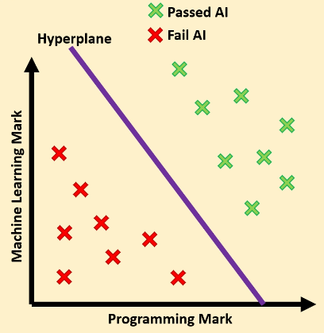
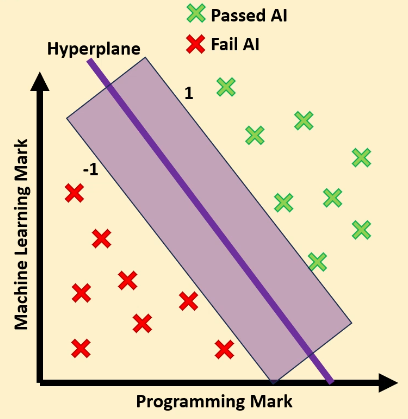
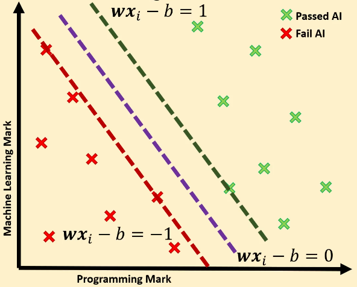
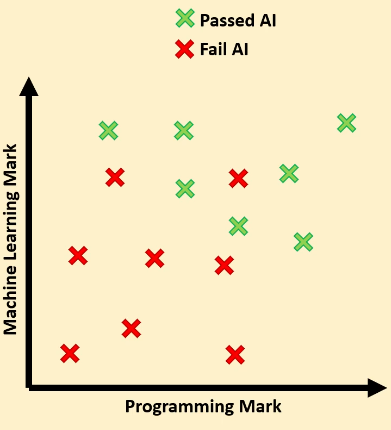
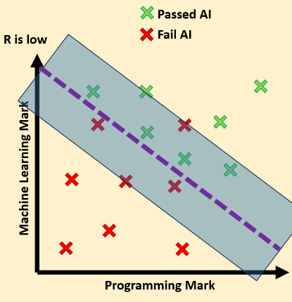
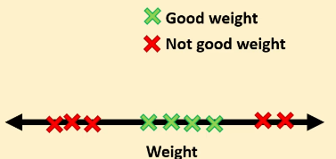
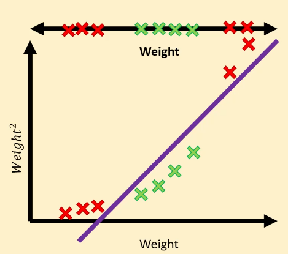

# SVMs

## Maximal Margin Classification

MMCs can classify linearly separable datasets.
They draw a hyperplane that separates datasets.

The plane has the equation $wx - b = 0$.

We can determine the label by taking the sign of the equation given the features: $h_w(x) = \text {sign} (wx - b)$.

How do we find $w$ and $b$?
Two constraints:
1. $wx_i - b \geq +1$ if $y_i = +1$
2. $wx_i - b \leq -1$ if $y_i = -1$

We also want a large margin between both labels for better generalisation.

To get this margin, we need to minimise the euclidean norm of $w$, our cost function. 

$$
||w|| = \sqrt {\sum \limits _{j=1} ^{D} (w^{(j)})^2}
$$

We also need to satisfy the two constraints as well as minimising the cost function.

So our optimization problem is:
minimise $||w||$ subject to:
1. $wx_i - b \geq +1$ if $y_i = +1$
2. $wx_i - b \leq -1$ if $y_i = -1$

This method ONLY works for linearly separable data. 

### Support vectors

We end up with 3 hyperplanes from this method - the decision boundary, and the two boundaries to the margin.

The vectors on the margins are called the support vectors. 

## Soft Margin Classification 

For this dataset, MMC won't work because they are not linearly separable. We can use a new loss function, Hinge Loss, to allow for some incorrect classification:

$$
\text {Cost} = R||w|| + \frac {1} {N} \sum \limits _{i=1} ^{N} \max (0, 1 -y_i(wx_i - b))
$$

$R$ tells us how incorrect our classifications can be. It defines the margin:

## Support Vector Machines

In this example a linear decision boundary won't work.

We can add another feature, for example weight$^2$.

We have achieved a linear decision boundary by applying a **kernel** to our data. 
  - Kernel functions
  - There are a range of functions we can use to find a linearly separable boundary.
  - For example, a polynomial kernel could have degree $2, 3, ..., n$. 
