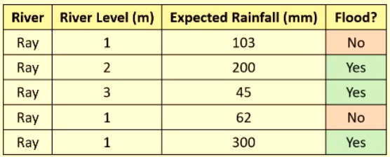

# Decision Trees

## Example - Rivers

We can use some operators to begin asking questions about our data: $=,<,>$. For example:
- river level $= 1$?
- expected rainfall $> 100$?
- etc.

Building the tree can start with an arbitrary question such as:

Since the right leaf already only has True labels, we don't need to split it any more. The leaf on the left needs to be split further.

These two questions are enough to classify all the labels in our training dataset. 

It does not generalise well though: for example, if there is $0.1m$ of rain and no rainfall, the river is still classified into the flood category. 
- They are very reliant on training data because they are a non-parametric model.

## Constructing a tree algorithmically

Performing full optimisation is very computationally expensive, so we will look at greedy approach.

### Example

1. Calculate number of river and stream samples.
    - 3 of each
2. We can use "entropy" to figure out which feature to query first.
    - entropy is the measure of homogeneity in a dataset. 
    - we want to **decrease** entropy in our dataset, to make our dataset more homogeneous.

Entropy is calculate using the formula:

$$E(x) = - \sum \limits _{i=0} ^{c} P(i) \log _2 (P(i))$$

This sum iterates over each class. $P(i)$ is the probability of that class being chosen. 

Notice that maximum entropy is at $0.5$, where data is completely evenly split, or in other words completely heterogenious.

Let's calculate entropy for our dataset: $E(S) = 1$ since the data is evenly split.

3. Now we can decide which feature to split on. We calculate entropy for each feature. 
- Depth is deep or shallow. $E(D_s) = 0.92$, $E(D_d) = 0.92$. Calculating entropy for the feature as a whole is the average entropy of each feature label, so $E(D) = 0.92$.
- Width: $E(W_s) = 1, E(W_m) = 0, E(W_l) = 0$ so $E(W) = 0.3\bar {3}$.
- Length: $E(L_s) = 0, E(L_m) = 1, E(L_w) = 0$ so $E(W) = 0.3\bar {3}$.

Now that we know the entropy of each feature we can calculate the information gain of each. Information gain is how much we reduce entropy (increase homogeneity). $G(x)$ is the information gain of feature $x$:

- $G(D) = E(S) - E(D) = 0.08$
- $G(W) = E(S) - E(W) = 0.6\bar{6}$
- $G(L) = E(S) - E(L) = 0.6\bar{6}$

We will choose to split on either width or length, since they have the highest information gain. 

Splitting on width:

We now repeat the process with the node that still has entropy. 

### Continuous values

Follow these steps:
1. Rank the order of the elements 
2. Calculate midpoints between each element
3. Calculate the information gain from each midpoint
4. Select the midpoint with the highest information gain

#### Example

1. Order: $0.5, 0.5, 1, 2, 3$
2. Midpoints: $0.5, 0.75, 1.5, 2.5$
3. Calculate information gain by splitting over the midpoints
4. Choose highest

