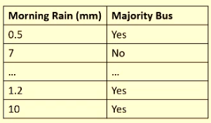
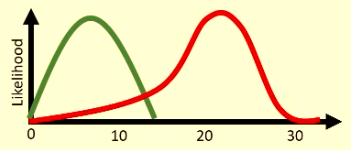
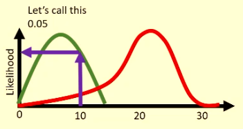
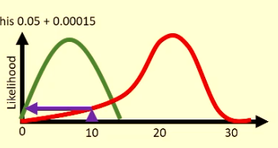

# Naive Bayes

It is a type of generative learning algoritm that learns distributions of inputs for given classes. It's also a non parametric model.

It uses Bayes rule:

$$P(A|B) = P(A) \times \frac {P(B|A)} {P(B)}$$

We assume each feature is independent, hence the naivity.

## Multi feature Naive Bayes

We can generalise Bayes rule by representing a set of conditions as $B$:

$$P(A|x_0 \cap x_1 \cap ... \cap x_n) = P(A) \times \frac {P(x_0|A)P(x_1|A)...P(x_n|A)} {P(x_0)P(x_1)...P(x_n)}$$

## Gaussian Naive Bayes

How do we incorporate continuous features in Naive Bayes?

### Example

Steps:
1. Calculate mean of the continuous feature.
2. Calculate standard deviation of the feature.
3. Do the above separately based on the output classes.

Green is yes, red is no.

#### Given 10mm of rainfall, will majority bus?

First, make a $P(A)$ guess. 65% of the rows are "yes", so guess $P(A) = 0.65$.#

Next, to get $P(B|A)$, check $10$ against our distribution and find the likelihood:

Now we just need $P(B)$, which is the total of 10mm at any class:

So $P(B) = 0.05 + 0.00015 = 0.05015$

$$P(A|B) = 0.65 \times \frac {0.05} {0.05015} = 0.648$$