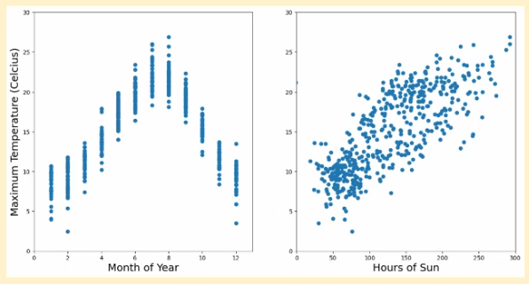
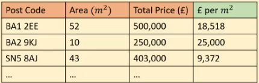
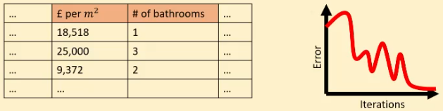

# Feature Engineering

Features can be categorical or continuous.

## Feature Selection

If we use the wrong data, we can expect to get the wrong model: garbage in, garbage out. 

### Causation vs Correlation

Which feature would be better to predict maximum temperature?
- Month of the year gives an abstraction of many features
    - hours of sun, weather, etc
- Hours of sun is a more causal relationship

### Feature Creation

For example, there might be a more causal relationship between "price per square metres" than just "price":

We have created the green column from the features we already had.

## Model Considerations

Distance based methods
- Different features having different scales, e.g. one feature in order of 10s and another in order of 1000s

Grouping based methods
- Splits data into groups, treats features independently so not much, if any, feature engineering required

Regression based methods
- For linear regression, the data must be linear with respect to the label.

## Handling Categorical Features

If a feature is a string for example, we usually need to convert them into numerical features.
- Labelling categorical features with $0, 1, 2, ..., n$ won't work for distance based models since the label has no gauge on how similar they are.
- Instead, use one-hot encoding. 
    - using one-hot encoding alongside other features with larger scales can make distance based models much to sensitive to the features with larger scales

### Binning

Binning is putting multiple continouous values into one "bin", for example putting all values from 0 to 10 in one bin, 11 to 20 in the next, etc.

## Data Scaling

Having data with vastly different scales can cause very different parameter updates in gradient descent each iteration. 

### Normalisation

- Scales data between 0 and 1
- Does not distort the data range
- Outliers will cause distribution to condense around the mean

### Standardisation

- Gives every distribution provided a mean of 0 and a standard deviation of 1
- Good for outliers
- Bad if you want all features to have the same scale