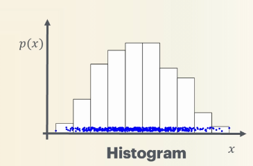

# Maths Intro

Joint and conditional probability. Ez

Product rule: 
$p(s,y) = p(y|s)p(s) = p(s|y)p(y)$ for dependent variables
$p(s,y) = p(s)p(s)$ for independent variables

Bayes' Rule: 
$p(s|y) = \frac {p(y|s)p(s)} {p(y)}$ 

## Random variables

A random variable $x$ is a variable that takes values from a sample set $\Omega _x$.

$\sum \limits _{x \in \Omega _x} p(x) = 1$

For two or more random variables $x,y$:
$\sum \limits _{y \in \Omega _y} p(x,y) = p(x)$

## Probability Densities

*Continuous random variables*. For the probability of $x$ landing in the interval $a,b$: $p(x \in [a,b])$.

$$p(x \in [a,b]) = \int \limits _a ^b p(x) dx$$

For the probability of the entire range, $\Omega _x$:

$$p(x \in \Omega _x) = \int \limits _{-\infty} ^\infty p(x) dx = 1$$.

### Data binning/histograms

This can be approximated using bins instead of integration. 

### Expected outcomes

These are the expected outcomes across the entire range of values, $\Omega _x$

For discrete functions:
$$\mathbb {E} [f] = \langle f \rangle = \sum \limits _{X' \in \Omega _x} p(x=X')f(X')$$ 

For continuous functions:
$$\mathbb {E} [f] = \langle f \rangle = \sum \int _{x' \in \Omega _x} p(x')f(x')dx'$$ 

$$\mathbb {E} [af + b] = a\mathbb {E}[f] + b$$

### Variance

$$\text {Var} (x) = \mathbb {E}[(x - \mathbb {E}[x])^2] = \mathbb {E}[x^2] - \mathbb {E}[x]^2$$ 

## Higher Dimensions

If the random variable $x$ has many dimensions $x = [e_1, e_2, ..., e_n]^T$, then 

$$\mathbb {E}[x] = [\mathbb {E}[e_1], \mathbb {E}[e_2], ..., \mathbb {E}[e_n]]^T = \frac {1} {N} \sum \limits _{i=1} ^N x_i$$

### Covariance

Covariance shows the spread of variables in multiple dimensions. 

$$\text {Cov} (e_i, e_j) = \mathbb {E}[(e_i - \mathbb {E}[e_i])(e_j - \mathbb {E}[e_j])]$$

These are placed in a matrix. 

### Moments

$$\mathbb {E}[(x - \mathbb {E}[x])^p]$$

For $p=2$, this is the variance.

For $p=3$, this is the skew: how symmetric a distribution is around the axis.

For $p=4$, this is the kurtosis: how heavy tailed a distribution is, for example a distribution with high kurtosis has larger values as it "tails" off to infinity, or tails off slower than one with lower kurtosis.

## Distributions

Examinable.

- Bernoulli
- Poisson
- Gaussian/normal

# Linear Algebra

A tensor is a multi dimensional array with 3 or more dimensions. 

$$T \in \mathbb {R} ^{N \times C \times H \times W}$$

## Vectors

For a 2-vector:

$$||v||_2 = \sqrt {v_1 ^2 + v_2 ^2}$$ 

### Linear dependence 

A set of vectors $\set {v_1, v_2, ..., v_n}$ is linearly dependent if there is a set of scalar values, not all equal to zero, such that $a_1v_1 + a_2v_2 + ... + a_nv_n = 0$. If this set of scalars doesn't exist then they are linearly independent. 

Span of vectors, basis of vectors
