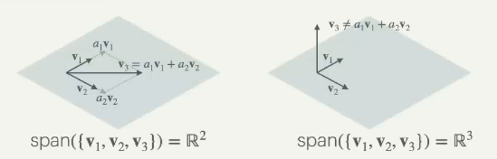
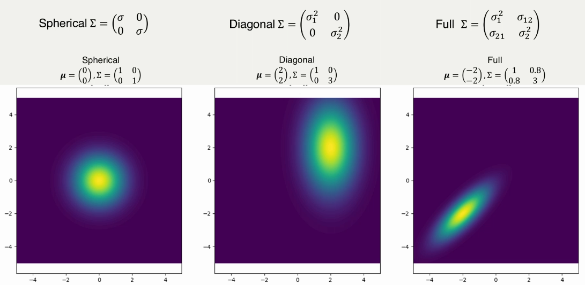

# Vectors

## Spans and Basis

The span of a set of vectors is the set of all vectors that can be written as linear combinations of the vectors in the span:

$$\text {Span} (\set {v_1, v_2, ..., v_n}) = \set {a_1v_1 + a_2v_2 + ... + a_nv_n}$$

A basis is a subset of the space $\mathbb {R} ^n$ formed by a span.

The left span has linearly dependent vectors so the basis is $\mathbb {R} ^2$, whereas the right span has linearly independent vectors so the basis is $\mathbb {R} ^3$.

### Canonical Basis

The canonical basis in space $\mathbb {R} ^n$ is a span of $n$ vectors, all of which have exactly one 1 and the rest zeros, none overlapping dimensions. 

### Matrix Rank

The rank of a matrix is the number of linearly independent columns in the matrix. 

For a $m \times n$ matrix M, $\text{rank}(M) \leq \min (m, n)$.

## Dot product

The dot product of two vectors is the sum of their element-wise multiplication. It also equals:

$$u \cdot v = ||u|| \cdot ||v|| \cdot \cos \theta$$ 

where $\theta$ is the angle between the two vectors. Orthogonal vectors have a dot product of zero. 

## Matrices

Orthogonal matrices, ones that are made up of entirely orthogonal vectors, have equal transpositions and inverses: $A^T = A^{-1}$.

Symmetric matrices: $A = A^T$. Symmetric along the diagonal.  

## Eigenvalues and Eigenvectors

go back to this you fatass

## Covariance

$$\text {cov} (X_j, X_i) = \text {cov} (X_j, X_i) = \frac {1} {n-1} \sum \limits _{l=1} ^n (x_i^{(l)} - \mu _{X_i})(x_j^{(l)} - \mu _{X_j})$$

For the diagonal:

$$\text {cov} (X_i, X_i) = \frac {1} {n-1} \sum \limits _{l=1} ^n (x_i^{(l)} - \mu _{X_i})^2$$

which is just the variance. 

$$\text {Correlation} (X_i, X_j) = \frac {\text {cov} (X_i, X_j)} {\text {var} (X_i) \text {var} (X_j)}$$

### Example

As seen on he right image, there is a diagonal relationship following a $y=x$ line. This is because the covariances between $x$ and $y$ are non-zero. 

### Eigendecomposition

