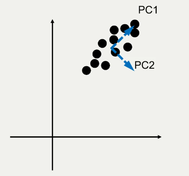

# Principle Component Analysis

## Dimensionality reduction

PCA assumes that the data is distributed with a gaussian distribution. 

$$\text {Norm} (x|\mu, \sigma) = \frac {1} {\sqrt {2 \pi \sigma}} \exp \left [ -\frac {(x - \mu)^2} {2 \sigma ^2} \right ]$$

To calculate the optimal values of $\mu$ and $\sigma$ to represent the distribution:

$$\mu = \frac {1} {n} \sum \limits _{i=1} ^n x_i$$

$$\sigma^2 = \frac {1} {n - 1} \sum \limits _{i=1} ^n (x_i - \mu)^2$$

### Multivariate Gaussian

$$\text {Norm} (x|\mu, \Sigma) = \frac {1} {2 \pi ^{D/2} |\Sigma|^{1/2}} \exp \left [ -\frac {(x - \mu)^T \Sigma ^{-1} (x - \mu)} {2} \right ]$$

where $\Sigma$ is the covariance matrix, and $|\Sigma|$ is the determinant of it.

### Data Whitening

For the eigendecomposed covariance $V \Lambda V^T$, if we set the diagonals of $\Lambda$ to 1, then the distribution becomes a sphere again. 

## PCA

1. Fit a gaussian
2. Find the axes of highest variance (principle components)
3. Display data on the axes of high (non-zero) variance

In this example, the principle components are PC1 and PC2, which we prefer to use over the x and y axes. This is because they capture more of the variance.

## White Noise

A vector of random variables is said to be white noise if the random variables have a mean of 0 and they are independently and identically distributed (iid). They typically have identity covariance. 

A linear transform is a whitening transform if it transforms data covariance $\Sigma$ to data with an identity covariance, meaning it is invariant to rotation. 

Independence implies identity covariance, but identity covariance **does not** imply independence. 

### Steps for PCA

1. Input $X = \left [ \begin {array} {} x_1^T\\ ...\\ x_n^T \end {array} \right ]$
2. Find the mean $\bar x$ of each $x$ and subtract: $B = \left [ \begin {array} {} x_1^T - \bar x_1 ^T\\ ...\\ x_n^T - \bar x_n ^T\end {array} \right ]$
3. Calculate the covariance matrix $\Sigma = \frac {1} {n-1} B^T B$
4. Compute eigenvectors and eigenvalues of $\Sigma = V \Lambda V^T$
    - $\Lambda$ is a diagonal matrix with the eigenvalues in the diagonal
    - $V$ is a matrix with columns with the corresponding eigenvectors
5. $P = BV$ gives a rotated representation of the ata on the principle axes.
    - we can normalise to whiten the data using $P = BV \Lambda ^{-\frac {1} {2}}$

Eigenvectors are always unit vectors. The eigenvalues describe the scale of each principle component of the eigenvector.

#### Dimensionality reduction

Once the eigenvectors and values are computed, sort the rows of both by the highest eigenvalue to the lowest and pick the top $k$, discarding the rest. This yields:

$$\Lambda _k \in \mathbb {R} ^ {k \times k}$$

$$V _k \in \mathbb {R} ^ {d \times k}$$
