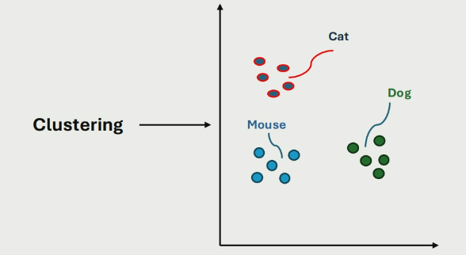

# K-Means Clustering

KMC is an unsupervised learning method, because the data points do not have labels. 

## Clustering

Clustering is assigning labels to data from an unlabeled dataset. 

## Description

- Relies on distance measurements.
- Data points that are close together are grouped into a defined number of clusters.
- K-means is used for hard assignment: each data point is assigned to exactly one cluster. 

The objective function is to minimise the squared error distance between points in each cluster. 

## Steps

1. Pick $K$ random centroids 
2. Calculate distances between centroids and data points using euclidian distance
3. For each data point, assign it to the centroid it is closest to. 
4. Find the mean centre of each cluster and set that as the new centroid.
5. Repeat 2-4 until the centroid doesn't change (convergence achieved), or until max iterations is met.

### Advantages

- easy to implement
- fast and efficient for large datasets
- rises linearly with number of datapoints

### Disadvantages

- sensitive to initial k values: bad values can lead to non-convergence
- struggles to find clusters if non hyper spheres
    - something to do with complex boundaries?
- very easy to get stuck in local minima

## K-Means ++

Select a datapoint as the first centroid randomly, and then set the next centroid as the furthest datapoint away from it. This aims to maximise the spread of the initial clusters to encourage convergence.