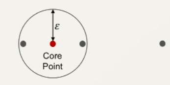
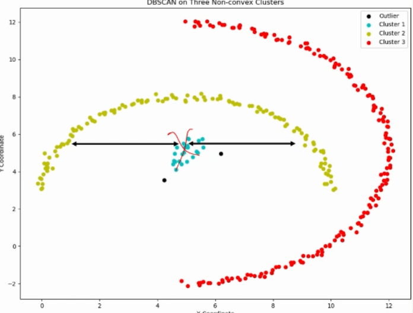

# Hierarchical Clustering

K-means
    - unknown $K$ value when starting
    - sensitive to initialisation
    - constrained cluster shapes (hyper sphere)

Hierarchical Clustering
- creates hierarchy of clusters
- each datapoint belongs to **one or more** clusters
- each cluster belongs to another cluster, or includes all the data

## Agglomerative (bottom-up)

1. Start with $N$ clusters, each with one datapoint.
2. At each step, merge the two clusters that are closest to each other.
3. Linkage criteria determines which distance to use between sets of observations
    - Single linkage: distance betweeen closest members in clusters
    - Complete linkage: distance between farthest members of clusters
    - Average linkage: mean distance between members of clusters
4. These steps are repeated until all datapoints are in one cluster

# VS Divisive
- Slightly more expensive computationally
- More flexible in defining distance metrics using the linkage
- Easier to implement
- Best for fine detail in data

E.g.:
- a few thousand samples 
- very detailed relationships

## Divisive (top-down)

1. Start with all datapoints in one cluster.
2. Split the cluster into two
    - Using farthest datapoint from the mean
    - Using k-means where $K=2$
    -
3. Keep splitting each cluster into 2 until each node is in its own cluster, or until desired number of clusters is reached.

More common approach is to use k-means to separate each cluster into 2. 

# VS Agglomerative
- Slightly less expensive computationally
- More difficult to implement
- Better for large datasets with clear cluster separation. 

E.g.:
- Millions of products
- clearly separate categories like tags

## Density Based Spatial Clustering of Applications with Noise (DBSCAN)

$\epsilon$ - radius to check for other points
$N$ - a number of sets a threshold "mass" expected in the area

Three types of datapoints:
1. Core points: $\geq N$ neighbouring datapoints with distance less than $\epsilon$
2. Border points: $< N$ neighbouring datapoints with distance less than $\epsilon$, but one is a core point
3. Noise points: $< N$ neighbouring datapoints with distance less than $\epsilon$

Example, for $N=3$ and some $\epsilon$:

The two points in the circle are border points, and the other is a noise point. 

DBSCAN can create non-convex decision boundaries. It is also good for noisy datasets. 

However, if $\epsilon$ is too small or if $N$ is too high, clusters may be separated into too many clusters or many datapoints may be classified as outliers.