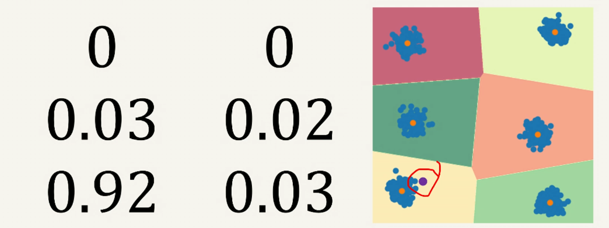

# Gaussian Mixture Model

## Cluster Assignment

In K-means, datapoints are assigned to one and only one cluster - they are hard assigned. 

Hierarchical clustering is a soft cluster assignment, since datapoints can belong to multiple clusters. 

What if we produce a probability for a datapoint being in any cluster in K-means?

Being closer to borders yields higher probability for those clusters on the border. 

## GMM

Using $K$ different gaussians centred on each cluster's mean to build a probability of a datapoint being inside any of these clusters.

### 1D Example

Given two distributions that have parameters $\mu_1, \sigma_1$ and $\mu_2, \sigma_2$, and a probability that a datapoint comes from them $\pi_1, \pi_2$, how do we calculate the probability that a datapoint is in either class?

$$\theta = \set {\mu_1, \mu_2, \sigma_1, \sigma_2, \pi_1, \pi_2}$$

$$p(c|\theta) = \pi_c$$

for class $c$. This is our prior. 

$$p(x| \theta) = \sum \limits _c p(x, c|\theta) = \sum \limits _c p(x|c, \theta)p(c|\theta)$$

Our noise model is:

$$p(x|c, \theta) = \mathcal {N}(x;\mu_c, \sigma_c)$$

The aim is to optimise these parameters to fit the data. 

### Optimising Parameters

Likelihood functions: for a set of datapoints $\set {x^{(1)}, ..., x^{(N)}}$:

$$L(\theta|\set {x^{(1)}, ..., x^{(N)}}) = p(\set {x^{(1)}, ..., x^{(N)}}| \theta)$$

GMM assumes samples are iid. Meaning that:

$$L(\theta) = \prod \limits _{n=1} ^N p(x^{(n)}| \theta)$$

To prevent instability, we often consider the log likelihood instead:

$$\mathcal {L}(\theta) = \log \left ( \prod \limits _{n=1} ^N p(x^{(n)}| \theta) \right ) = \sum \limits _{n=1} ^N \log p(x^{(n)}| \theta)$$

### Training

The probability that a datapoint belongs to a class is $p(c|x, \theta)$. Using Bayes rule:

$$p(c=1|x, \theta) = \frac {\text {Gaussian for 1st class} \cdot \pi_1} {\text {Gaussian for 1st class} \cdot \pi_1 + \text {Gaussian for 2nd class} \cdot \pi_2}$$

The centres are updated... 

not understood yet