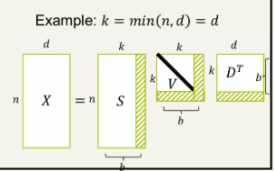
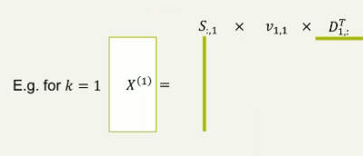

# Singular Value Decomposition

## Decomposition

Matrix decomposition or factorisation is the task of separating a matrix X into a product of multiple that have specific properties.

## SVD

Any matrix $X \in \mathbb {R} ^{n \times d}$ can be written as $X = SVD^T$.

- $S \in {R} ^{n \times d}$ is a matrix with an orthonormal basis as its columns
- $V \in {R} ^{k \times k}$ is a diagonal matix with the ordered singluar values of $X$ in its diagonal
- $D \in {R} ^{d \times k}$ is a matrix with an orthonormal basis as its columns.

## Matrix Rank

A rank of a matrix $M$, written $\text {rank} (M)$ is the number of linearly independent columns in the matrix. 
- $\text {rank} (M) = \text {rank} (M^T)$

*Orthonormal - vectors in matrix must be normalised, unit vectors. Orthogonal means taking dot products between vectors means 0, but they don't necessarily have to be unit vectors. Basically synonymous.*

To approximate SVD on a matrix that is rank deficient:

for a matrix $X$ such that $\text {rank} (X) = b < \min(n,d)$.

## k-Rank approximations

For a $k$ rank approximation, take $S_{:, :k}$, $V_{:k, :k}$, and $D_{:k, :}^T$. $V_{i,i}$ is in descending order, so the diagonal values decrease as you go down. 

### Frobenius Norm

Way to calculate error in matrices:

$$F(A,B) = \left \| A - B \right \| _F = \text {all the absolute elements added and the sum rooted}$$

### SVD Properties

The compression scheme of SVD tries to fill out values using patterns in the matrix, because by reducing the k-rank of SVD, it assumes that some of the vectors are linearly dependent.

## SVD and PCA

Covariance matrix of $X$ is $X^TX \in \mathbb{R} ^{d \times d}$

$$X^TX = DVS^TSVD$$

$$= DV^2D$$

(because $S$ is orthogonal, so it's dot product is $I$).

A covariance matrix has a unique decomposition $X^TX = D \Lambda D^T$, so here $\Lambda = V^2$.

The singular values are equal to the square root of the eigenvalues of the covariance matrix $X^TX$. The columns of $D$ are the corresponding eigenvectors/principle components. 

From the same process, $XX^T$ shows the the columns of $S$ are the eigenvectors/principle components of $XX^T$. 