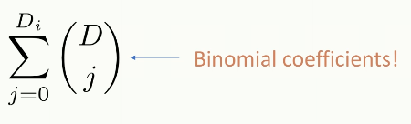

# Shallow Networks

Example of a shallow network, with activation functions $a$.

ReLU: Rectified linear unit. 
- Activation functions allow some of the parameters to be active while others are not, which adds complexity to the function the network can model. 

We abstract away some detail with hidden units:

Graphical representation:

Biases are usually omitted from the graph.

*with enough hidden units, a shallow network can describe any continuous function to arbitrary accuracy.*

The number of regions that a shallow neural network can separate the inputs into is:

