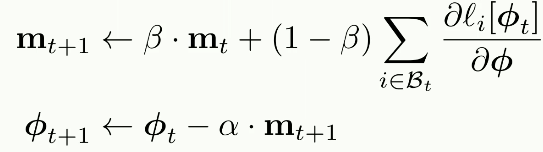
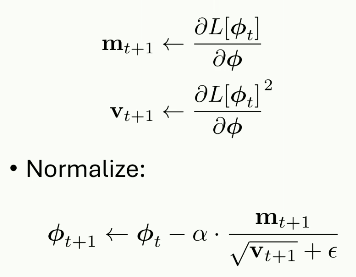

# Optimisations

## Momentum

Momentum is a slight change to SGD such that the parameters are updated by a weighted sum of past gradients:

$\beta$ is the weighting of current gradient to previous gradients. It gives slightly smoother traversal of the loss function, which can reduce the steps taken to arrive at a global optimum. 

### Nesterov accelerated momentum

Instead of stepping towards local minimum using the current gradient and then adding the previous gradient, NAM adds the previous gradients, then calculates the new gradient and adds it. 

## Adam

Adaptive Moment Estimation (Adam) aims to make sure that all gradients have roughly the same scale, to avoid the loss jumping around sporadically.

The update $\textbf{m}$ is divided by the square root of its square, effectively normalising it, and adding a small term $\epsilon$ to avoid divided by 0 errors. The gradients are normalised so that the direction is preserved but the magnitude is not.

Adam essentially creates an adaptive learning rate for each parameter by normalising the gradient vectors.