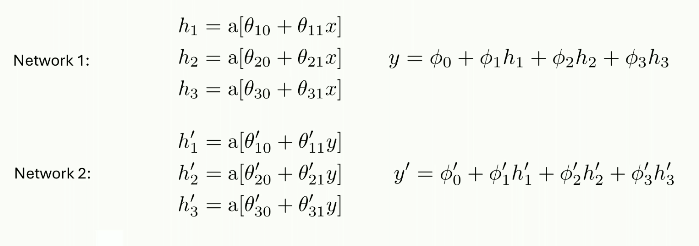
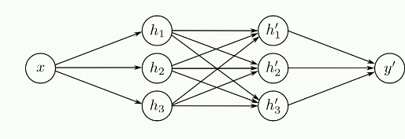
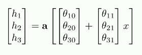
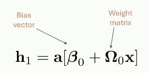

# Deep Neural Networks

- Networks with more than one hidden layer
- Intuition becomes more difficult!

## Composing two Shallow NNs

Stacking these two networks end to end looks like this:

Composing the two functions creates a much more complex line:

## Combining two NNs

Skip out the $y$ connection and connect all $h$ neurons to all $h'$ neurons. 

We change our notation to represent the network as matrices and vectors. 

And we can represent the vectors and matrices by using different greek letters:

