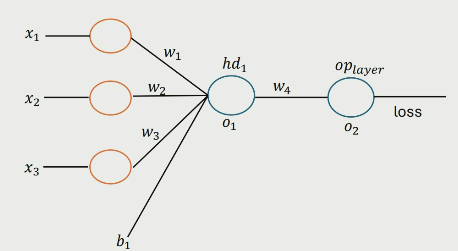

# Backpropagation

- The algorithm used to adjust the weights in a neural network aiming to minimise the loss function via gradient descent.

## Forward pass

- Calculate by sending the input through the network.
- Matrix multiplication of weights, add the bias and then apply the activation function.

## Chain Rule

$$
w_4 \leftarrow w_4 - n \frac{\partial L}{\partial w_4}\\
\frac{\partial L}{\partial w_4} = \frac{\partial L}{\partial o_2} \cdot \frac{\partial o_2}{\partial w_4}
$$

Using the chain rule, gradients are sent back through the network to calculate the corresponding gradients in previous layers.

## Backward pass

- Going from outputs to inputs, calculating gradients using chain rule.

Learn to do this by hand.