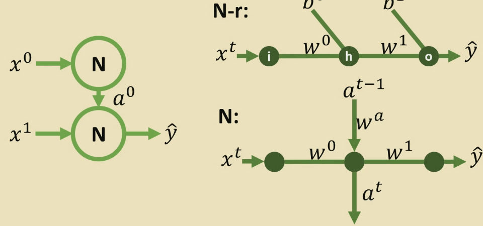

# Recurrent Neural Networks

- Reduces number of parameters
- Allows any number of time steps, in comparison to an MLP

## Recurrent Units

*Biases omitted for simplicity*

Using the same parameters ($w_0, w_1$) for each timestep reduces the number of parameters required to train. This saves memory and reduces training time. 

RNNs take a lot of time to infer, because they have to process data sequentially. This means they can't easily be distributed. 

## Different RNNs

### Limitations

1. Inference is slow
2. No look ahead
3. Long term memory is an issue - it only looks at the last state
4. Vanishing/exploding gradients
    - Weights below 1, with large number of time steps, tend the activation to 0.
    - Weights above 1 tend the activation to infinity with large time steps.