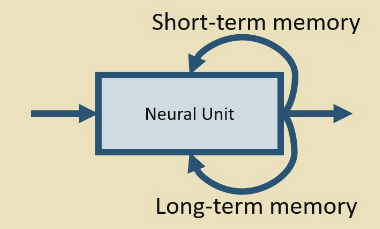
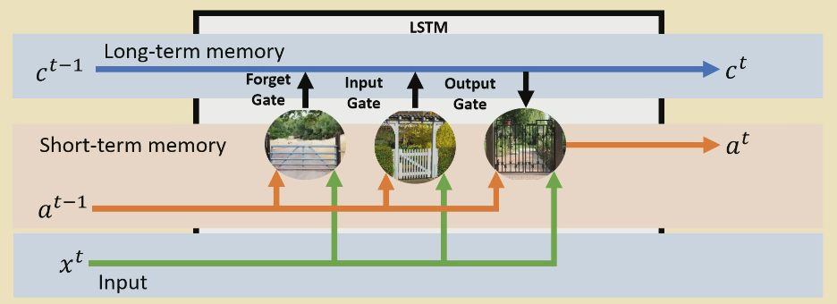

# LSTMs 

The LSTM has two routes for memory instead of one like in the RNN. 

There are three types of gates in an LSTM:
- Forget gate
    - Allows the model to "bin" long term memory if it isn't important
- Input gate
    - Specifies how the long term memory is updated
- Output gate
    - Specifies how the short term memory is updated

## Forget gate

Does a dot product of short term memory $a^{t-1}$ and input $x^t$ and puts it through sigmoid. This outputs a scalar, a **percentage** of the long term memory that should be remembered. Then multiplies this by the long term memory. 

## Input gate

Dot products and applies $\tanh$ to create the new memory, then does the same sigmoid trick to decide how much of the memory is added into the long term memory. $\tanh$ allows negative memories, so we can subtract from the long term memory. 

## Output gate

From the long term memory, we apply $\tanh$ and multiply by our dot producted $a^{t-1}$ and input $x^t$ again with sigmoid.     

## Vanishing Gradient

The LSTM provides 3 routes for error to be propagated, and $\tanh$ helps with this too. 