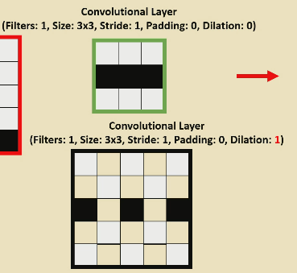

# CNNs

- CNNS extract and learn features by themselves
- They are made up of convolutional, pooling and fully connected layers.
- Filters have three hyperparameters
    - Filter size
    - Stride
    - Dilation
- Complexity of the features gets higher as you go deeper into the network
- Not just images! Timeseries - 1D, videos - 3D.

## Pooling

- Pooling layers have a kernel but no filter
- They pick the largest value in the kernel. 
- You can lose information, for example if many features are present in one max pool kernel you only get one back

## Dilation rates

- Enables larger receptive field
- Better than using a larger filter because there are less parameters to optmise than in the larger filter.

## CNNs as shallow NNs

- Each weight in the filter can be thought of as a weight in a shallow neural network. These aren't fully connected because only some nodes in the input layer are mapped to output nodes. 
- Output nodes are only related to a subset of the input
- The same parameters are used in many mappings from input to output
    - Fewer parameters to optmise