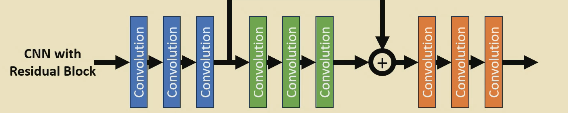

# Residual Networks

- Vanishing/exploding gradients can ooccur in any deep network. 
- Identifying gradient problems:
    - Abnormal gradient distributions - plotting the distributions of gradients at each epoch at different layers in the network
    - Chaotic learning curves - high variability in the training curves, including testing being better than training
    - Zeroing out - outputs tending to 0 or to the mean of the data. 

Relu minimised vanishing gradients.

## Skip Connections and Residual Blocks

Here, gradients are carried over the green conv layers, meaning any vanishing or exploding that happens is mitigated for the blue layers.

- Residual blocks require the start shape of the block and the end shape of the block to be the same.
- Skip connections are not residual blocks - the connections skip part of the network, whereas the residual block has skips over itself.
- Adds computational cost
- Very difficult to interpret - hard to look at filters and what they are doing
- The network can just become an identity function - it optimises some of the layers but skips entire blocks, which wastes computation
    - Identify gradient distributions to check for this