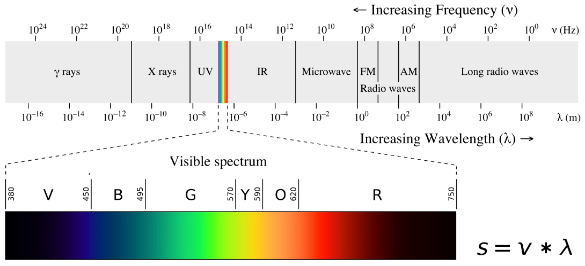
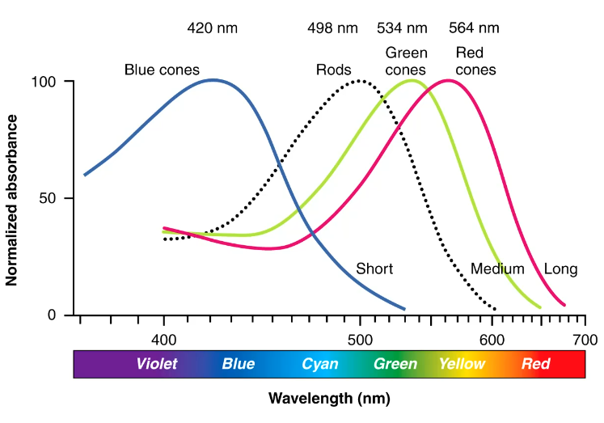
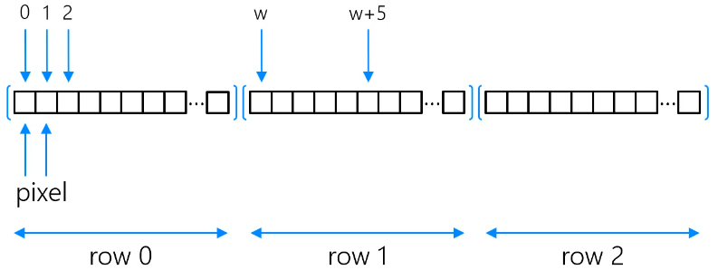
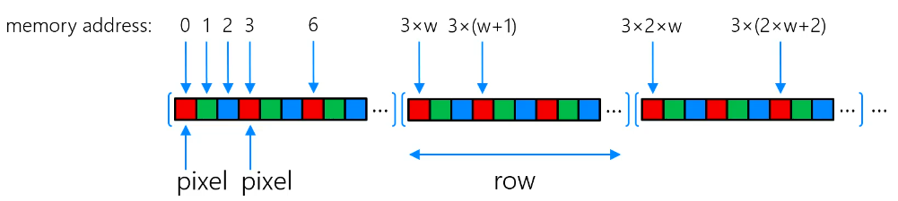

# Images and Colour

## Visible Light

We calculate outgoing radiance ($R$) by multiplying incident radiance ($E$) by reflectance ($S$). The wavelength is $\lambda$.

$R(\lambda)=E(\lambda)S(\lambda)$

## Cones and colour display

Human's have trichromatic vision.
- 3 cones are sensitive to long, medium and short wavelengths
- peaks correspond to RGB

The human retina has:
- ~6 million cones (colour vision)
- ~120 million rods (low light vision)
- Cones $\neq$ colours. They merely correspond to long, medium and short wavelengths.

## Digital Images

Digital images are 2d sampled representations of some continuous function, e.g. a real scene. These functions need to be discretized for computer representation. We can transform continuous real life scenes into pixels for example.

### Pixels

Pixels are the smallest sampled region of an image.
- the RGB colour is chosen as the average of the entire real life area that is represents.

### Image storage

Images are arranged:
- pixels in rows left to right
- rows are stored top to bottom

$w$ is the width of the image.

To get the index of a pixel in memory, we multiply by the row number and add the column number. E.g. row 3, column 2 of a 6x4 image would be $3 \times 6 + 2 = 20$.

Colour images are arranged in the same way, but each pixel has three contiguous addresses in memory.

To get the index of a pixel in colour images, we just multiply the grayscale index by the number of channels (3 for RGB). There may be more channels e.g. alpha.

### Image Coding

Consider a 10 MP image with RGB and 32 bits per pixel.
- 40MB image.

Lossless compression e.g. PNG or GIF
- encodes frequent strings of bits by enumerating

Lossy compression e.g. JPEG 
- JPEG uses discrete cosine transform to encode high frequency components (like large blocks of similar colour) with fewer bits.

## Additive and subtractive colours

Additive - RGB
- screens use this colour method

Subtractive - CYM
- printers use this colour method
- since on printers, combining CYM to create black on the paper will soak it, we include K (black) to print grayscale parts of an image. This is CYMK.

