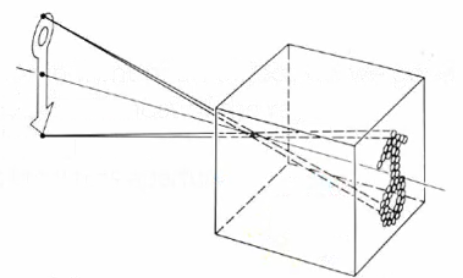
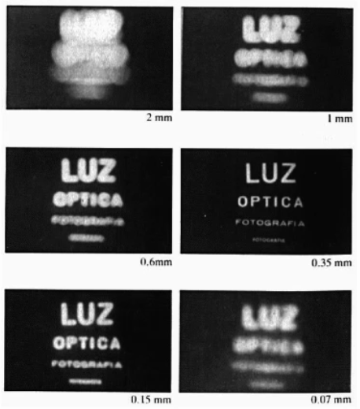
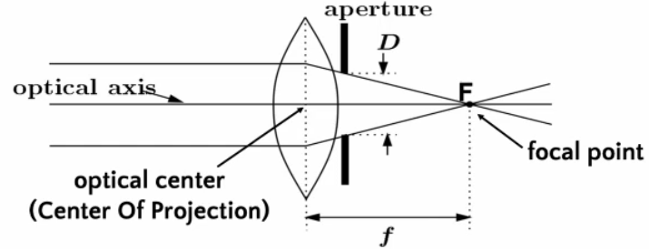
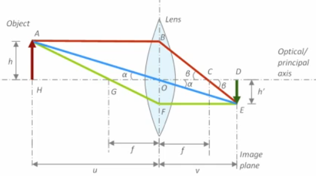

# Imaging and Display Technology

## History

### Chemical Photography

- First surviving photography was 1826, 8 hour exposure
- Daguerreotype process was the first commercially viable exposure technique, 1839
    - minutes for exposure
    - photo on metallic plate, no copies
- Calotype process uses paper based negatives, 1841
    - copies can be made

### Digital Photography

- Electronic only process
- Widely used since 1990s

## Formation of an Image

We need 3 things to form an image:

1. Geometry
2. Light
3. Colour

### Pinhole camera model

- The pinhole is called the **centre of projection** or **optical center**.
- The size is called the **aperture**.
- The image is formed on the **image plane**.

#### How Aperture affects the Image

Smaller aperture increases sharpness until a point
- light diffraction occurs 
- decreases the amount of light that can get through

The ideal pinhole is narrow enough that 1 photo maps to each pixel, but in real life this doesn't work due to the above constraints.

#### Lenses

Lenses can be used to focus light from the same point (at a specific distance) onto only one point, meaning the aperture can be wider.

To calculate the focal point:

$$\frac {1} {f} = \frac {1} {u} + \frac {1} {v}$$

where $u$ is the distance between optical centre and the object, $v$ is the distance between the image plane and the optical centre, and $f$ is the distance between the optical centre and the focal point.

## Image Sensor Types

- Turn continuous light into discrete pixels
- Cells in sensor detect photons
- CCD
  - serial devices that read out pixels one at a time
- CMOS
  - each pixel contains an amplifier, so can be read out faster
  - more expensive than CCD

## Image Display

Active displays:
- LCD
- Digital mirror display
- OLED
- Plasma displays
- Cathode ray tube

Passive displays
- Printers
  - laser 
  - ink-jet
  - commercial 