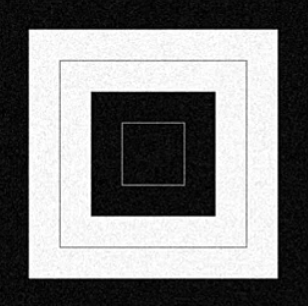
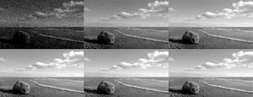
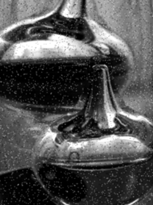
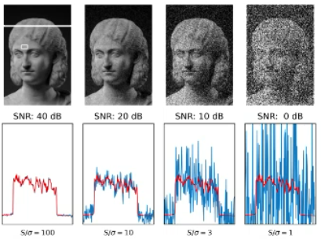
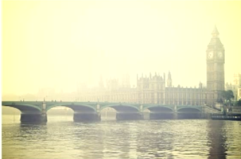
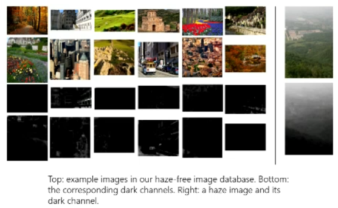

# Image Formation

## Image enhancement

### What is noise?

It is unwanted variation in pixel values (brightness or colour information). This degrades the visual quality of the image.

1. Thermal noise
2. Shot noise
3. Replacement noise

#### Thermal noise

Also known as additive gaussian noise. 
  - often due to random fluctuations in electrons when photo sensor is amplified 
  - highly related to ISO level
  - apply gaussian noise to simulate.
  - doesn't consider the actual pixels, just overlays the image

#### Shot noise

Also known as poisson noise.
  - highly related to photodiode of which the signal strength is proportional to the number of photons that hit the sensor.
  - the photons hit the sensor randomly
  - as a result of the photon heat
  - proportional to current intensity of the pixel

#### Replacement noise 

Also known as salt and pepper noise.
  - dead pixels - dark
    - defective or broken sensor
  - hot pixels - bright
    - voltage leak which amplifies pixel values
  - replaces original pixel completely

### Impact of noise on image quality

Signal to Noise ration (SNR)
  - expressed in dB
  - compares the level of desired signal to the level of background noise
  - not only for image

$$\text {SNR} = \frac {P_{\text {signal}}} {P_{\text {noise}}}$$

where $P$ means the power.

## Image Dehazing

Removes haze on images.

Used for:
  - image pre processing
  - self driving cars

### Dark Channel Prior

General image formation model with haze:

$$I(x) = J(x)t(x) + A(1-t(x))$$

Where:
$I(x)$ is the observed hazy image.
$J(x)$ is the scene radiance (clear image we want to recover)
$t(x)$ is the transition map. Describes how much light is not scattered and reaches the camera (indicating level of haze)
$A$ is the global atmospheric light. Represents ambient light scattered by atmosphere.
$x$ is a pixel in the image.

On haze free outdoor images, there is at least one channel that is very low intensity. If we replace the entire image with this "dark" channel, then we can see if there is haze.

Summary of steps:
1. Compute dark channel.
2. Estimate global light using dark channel.
3. Estimate transmission map based on dark channel prior. 
4. Recover scene radiance to obtain dehazed image. 