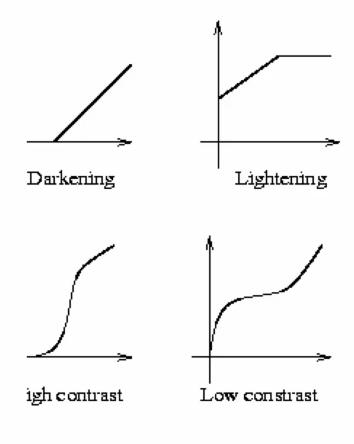
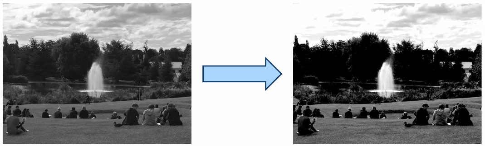
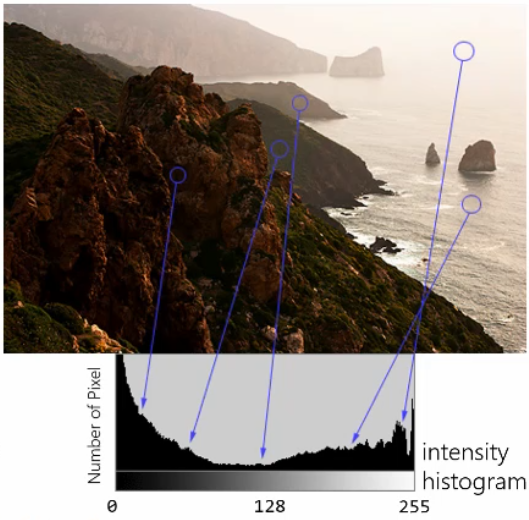
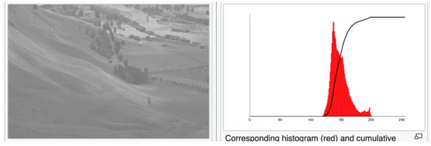
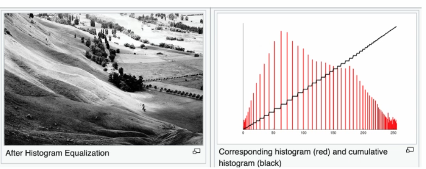
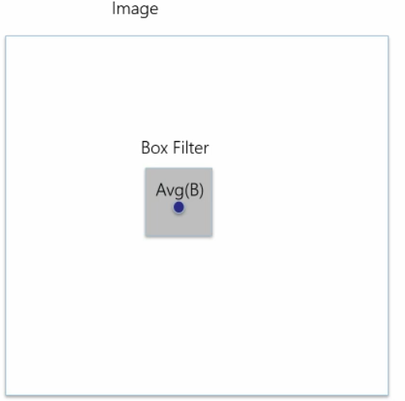
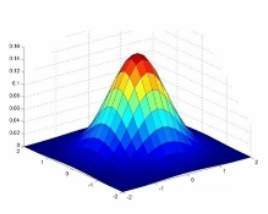

# Filters

## Example filter functions

$I(x,y) \to f(I(x,y)$

The filter is applied to each pixel individually.

## Quantisation

Colours are usually represented by $2^8$ values, a byte. Some applications use 10 bits, 12 bits etc. 

Some applications do not require high colour depth, for example for machine learning we may only use 3 bits. 

## Contrast Enhancement

$$O(x,y) = \left[\frac {I(x,y)-51} {0.6} \right] ^{255} _0$$

## Image Histogram

Count how many pixels have a certain intensity, and construct a graph to show this.

### Histogram equalisation

If we have an image like this:

We can spread out the image histogram to improve the range of colour in the image. 

## Neighbourhood filters

In a noisy image, point based filters (ones that work on individual pictures) may just amplify the noise. So we take into consideration the pixels around them too. 

Using a sliding box filter:

Slide the box across the image, with each pixel getting the average value of the pixels around it. 

But we want to prioritise pixels closer to the target pixel, so we use a gaussian filter, where each value in the kernel follows this function:

## Convolution

Properties of convolution
1. Commutative: $f \times h = h \times f$
2. Associative: $f \times (h \times g) = (f \times h) \times g$
3. Distributive: $f \times (h + g) = f \times h + f \times g$

Given convolution $f$ and $h$:

$f(x,y) \times h(x,y)$ is $f^T(h)(x,y)$