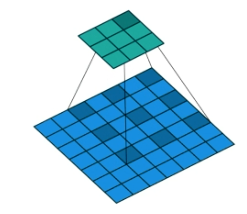
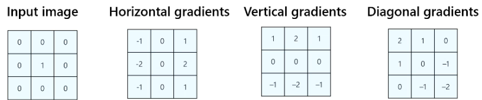
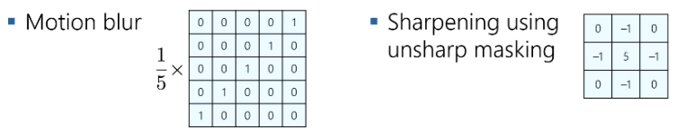
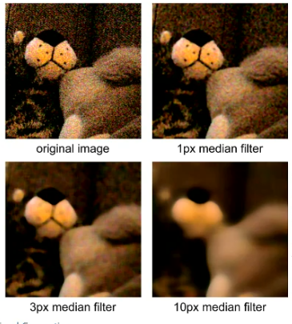
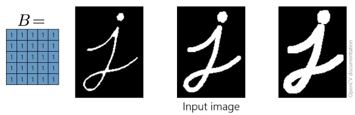

# Convolution and Image Filters 2

## Stride

Stride is how much the kernel moves across the image during each step.

$$\text {Output size} =\frac{\text {Input size} - \text {Kernel size}} {\text {Stride}} + 1$$

## Padding

Adds extra rows and columns to preserve the size of the output image.

$P = \frac {K - 1} {2}$

We do not consider even sized filters usually.

$$\text {Output size} =\frac{\text {Input size} - \text {Kernel size} + 2 \times \text {Padding}} {\text {Stride}} + 1$$

Two ways to pad:
1. Zero padding
2. Copy edges to padding

## Dilated Convolution

Here we add gaps into the kernel to allow the filter to cover a larger receptive field without adding any extra computation or parameters. 

## Filters

These filters are known as sobel filters. 

Note the sum of the filter should always equal 1. The sharpening filter reverses the motion blur effect.

### Median filter

Replaces each pixel in the image with the median value of the pixels in its neighbourhood. This is **not** a convolution filter.

Helps to remove salt and pepper noise.

### Morphological Filtering

This is **not** a convolution filter.

#### Erosion

Reduces the width of bright objects:

$$(I \ominus B)(x,y) = \min \limits _{(i,j) \in B} I (x-i,y-j)$$

#### Dilation

Increases the width of bright objects:

$$(I \oplus B)(x,y) = \max \limits _{(i,j) \in B} I (x-i,y-j)$$

