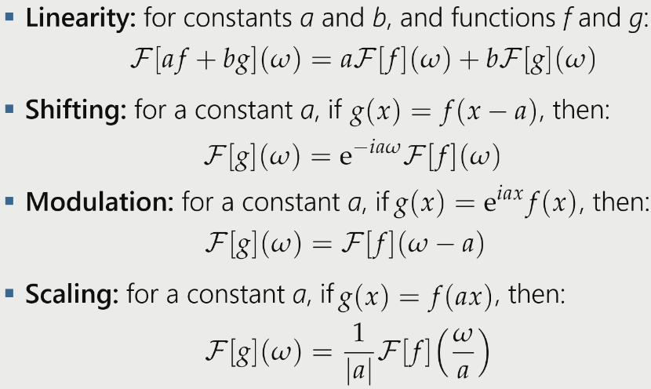
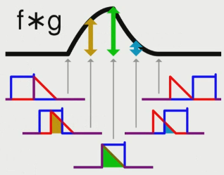
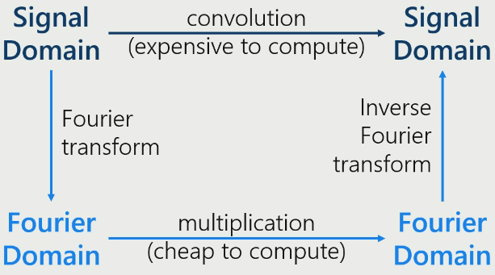
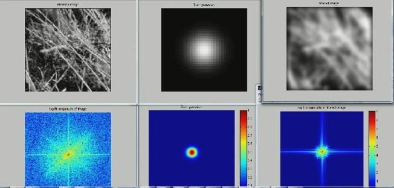
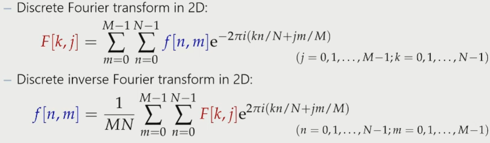
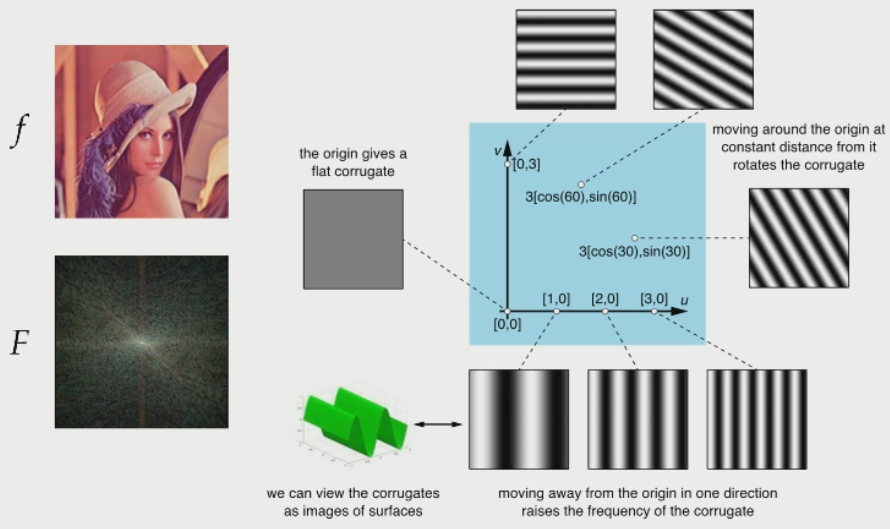
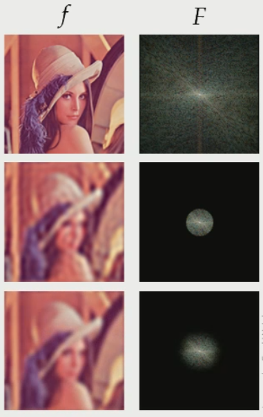
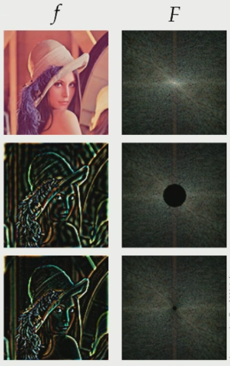
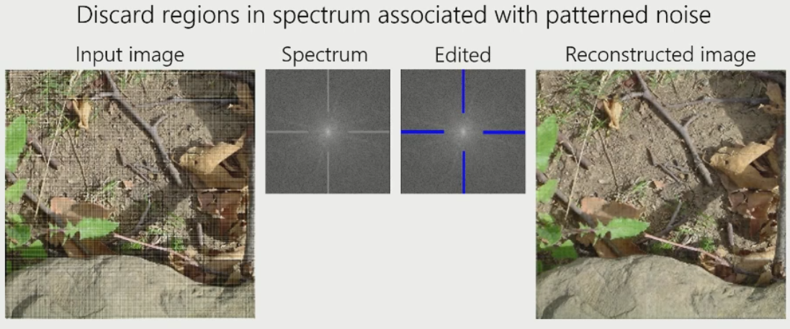

# Fourier Transform

## Complex Numbers

$$z = a + bi \in \mathbb C$$

Polar form:

$$z = r \cdot e^{i \phi}$$

Conjugate of $z$ is $z = a -bi$

### Euler's Formula

$$e^{i \phi} = \cos \phi \sin \phi$$

$$\cos \phi = \frac {e^{i \phi} + e^{-i \phi}} {2}$$
$$\sin \phi = \frac {e^{i \phi} - e^{-i \phi}} {2i}$$

## Fourier Transform

The fourier transform of a function is given by:

$$F(\omega) = \mathcal {F}[f](\omega) = \frac {1} {\sqrt {2\pi}} \int \limits _{-\infty} ^\infty f(x) e ^{-i\omega x} dx$$

Restoring from fourier:

$$f(x) = \mathcal{F}^{-1}[F](x) = \frac {1} {\sqrt {2\pi}} \int \limits _{-\infty} ^\infty F(\omega) e ^{-i\omega x} dx$$

For constants $a$ and $b$ and functions $f$ and $g$:

$$\mathcal {F}[af + bg] = a\mathcal {F}[f](\omega) + b\mathcal {F}[g](\omega)$$

This is proven by when integrating, to integrate functions separatley and factor out the constant. 

For a constant $a$, if $g(x) = f(x-a)$, then:

$$\mathcal {F}[g](\omega) = e^{-ia\omega} \mathcal {F}[f](\omega)$$

### Properties

### Convolution

The convolution $f*g$ of two functions $f$ and $g$ is given by:

$$(f*g)(x) = \int \limits _{-\infty} ^\infty f(x-y)(g(y))$$

This is for continuous functions, unlike pixel value which are discrete. 

#### Convolution Theorem

When you do convolution in the spatial domain, this corresponds to multiplication in the Fourier domain.

$$\mathcal {F}[f * g](\omega) = \sqrt {2\pi} \mathcal {F}[f](\omega) \cdot \mathcal {F}[g](\omega)$$

##### Example

Here, the bottom pictures are visualisations of the top pictures in the Fourier domain. The original image (top left) and the kernel (top middle) are transformed to the Fourier domain and multiplied together to get the convolved image (bottom left). This is then reversed to the spatial domain to get the final image. 

## Discrete Fourier Transform (DFT)

Instead of using integration, we use the sum, since we are dealing with discrete non-continuous data.

The $N$ values and converted into $N$ frequency components. 

DFT:

$$ F[k] = \sum \limits _{n=0} ^{N-1} f[n] e^{\frac{-2\pi ink} {N}}, k=0,1,2,...,N-1$$

Inverse DFT:

$$ f[n] = \frac {1} {N} \sum \limits _{k=0} ^{N-1} F[k] e^{\frac{2\pi ink} {N}}, n=0,1,2,...,N-1$$

### DFT in N-D

For colour images, we transform each channel independently. 

### Visualition

We can see the visualition is the sum of all of the corrugates.

### Low pass filter

Removes high frequencies higher than a threshold, which removes finer detail, and blurs image. 

The bottom filter is a gaussian filter, which is much smoother.

### High pass filter

This filter removes low frequencies to preserve fine details - edges. If you add the images from corresponding low pass and high pass filters you will get the original image back. 

The bottom filter uses 1-gaussian blur. 

### Remove Structure Noise

Removing structured noise in the spatial domain is much harder than in the fourier domain. 

## Fast Fourier Transform

Naive computation of DFT is $O(n^2)$ time complexity. 

FFT has complexity $O(N \log N)$.
- Much faster
- Drawback is that inputs must be $2^k$, so input may need to be padded.