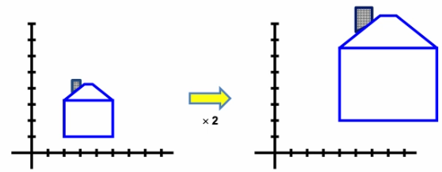
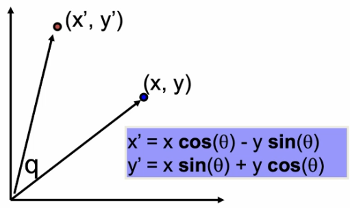
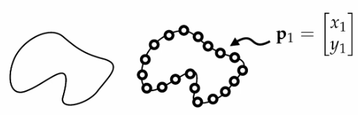
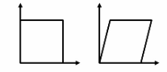
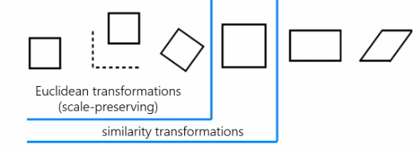

# 2D Transformations

## Types of Transformations

1. Rigid
    - the object moves as a whole, and its shape does not change
2. Articulated
    - a body made of several rigid bodies that are connected by joints
3. Non-rigid
    - the points on the body can move freely, for example a face

## Scaling

Uniform scaling means the scalar is the same for all components. 

Simply multiply all $x,y$ by 2 to double the scale of the house. 

Non uniform scaling can have different scalars for each component. For example, $x \times 2$, $y \times 0.5$. 

## 2D Rotation

How can we rotate the blue point to the red point?

In polar coordinates:

$x = r \cos(f)$
$y = r \sin(f)$

Where $f$ is the angle between the $x$ axis and the blue dot's vector. 

$x' = r \cos(f + q)$
$y' = r \sin(f + q)$

Where $q$ is the angle between the blue dot's vector and the red dot's vector. 

Using the trig identity:

$x' = r \cos(f)\cos(q) - r \sin(f)\sin(q)$
$y' = r \sin(f)\cos(q) + r \cos(f)\sin(q)$

Substitute:

$x' = x\cos(q) - y\sin(q)$
$y' = x\sin(q) + y\cos(q)$

## Transforming arbitrary shapes

Sample a continuous shape to obtain a discretised representation of it:

So we get a matrix of points with the first row being all the $x$ coordinates, and the second row being $y$ coordinates.

$$p = 
\left [
\begin {array} {}
x_1 & x_2 & ... & x_n\\
y_1 & y_2 & ... & y_n\\
\end {array}
\right ]
$$

We can transform the shape using matrix operations:

$$p' = M_{2\times 2}p$$

### Transformations in matrix form

#### Scale

$$M = 
\left [
\begin {array} {}
s & 0\\
0 & s\\
\end {array}
\right ]
$$

Where $s$ is the scaling factor.

#### Stretch

$$M = 
\left [
\begin {array} {}
\alpha & 0\\
0 & \beta\\
\end {array}
\right ]
$$

Where $\alpha$ is the $x$ scalar, and $\beta$ is the $y$ scalar. 

#### Flip

Horizontal flip:
$$M = 
\left [
\begin {array} {}
-1 & 0\\
0 & 1\\
\end {array}
\right ]
$$

Vertical flip:
$$M = 
\left [
\begin {array} {}
1 & 0\\
0 & -1\\
\end {array}
\right ]
$$

#### Shear/skew

$$M = 
\left [
\begin {array} {}
1 & k\\
0 & 1\\
\end {array}
\right ]
$$

Here, $x' = x + ky$ and $y' = y$. 

#### Rotation

Clockwise rotation:

$$M = 
\left [
\begin {array} {}
\cos \theta & -\sin \theta\\
\sin \theta & \cos \theta\\
\end {array}
\right ]
$$

Anticlockwise rotation:

$$M = 
\left [
\begin {array} {}
\cos \theta & \sin \theta\\
-\sin \theta & \cos \theta\\
\end {array}
\right ]
$$

#### Translation

Translation is simply vector addition.

$$p' = p + 
\left [
\begin {array} {}
t_1\\
t_2
\end {array}
\right ]
$$

But can we represent this is a matrix linear operation, as:

$$p' = Mp$$

#### Homogeneous Coordinates

The solution is to add another column to the transformation matrix.

$$Mp = 
\left [
\begin {array} {}
a_{11} & a_{12} & t_1\\
a_{21} & a_{22} & t_2\\
\end {array}
\right ]
\left [
\begin {array} {}
p_1\\
p_2\\
1\\
\end {array}
\right ]
$$

The third row in our $p$ is the homogeneous component.

Our new transformation formula is:

$$
\left [
\begin {array} {}
p'_1\\
p'_2\\
1\\
\end {array}
\right ]
=\left [
\begin {array} {}
a_{11} & a_{12} & t_1\\
a_{21} & a_{22} & t_2\\
0 & 0 & 1\\
\end {array}
\right ]
\left [
\begin {array} {}
p_1\\
p_2\\
1\\
\end {array}
\right ]
$$

Translation is now a linear operation. The reason for the third row in $M$ is to keep the same output size, and to keep a square matrix. Having a square matrix is useful because you can combine multiple transformations while preserving the dimensions. 

### Affine Transformations

The 3x3 transformation matrix is an affine transformation. They have 6 degrees of freedom:

### Compound Transformations

Translation: $p' = Tp$
Scaling: $p'' = Sp'$

Compound: $p'' = (ST)p$

Since matrix multiplication is associative. It is more efficient to do a 3x3 times 3x3 multiplication and then the new 3x3 by a 3xn (when n is large) rather than doing it on the 3xn multiple times. 

The order of compound transformations is very important. 

### Transpose transformations

$$p' = T_1T_2T_3p$$

Then:

$$p'^T = p^T T_3^T T_2^T T_1^T$$

The order is reversed. 
