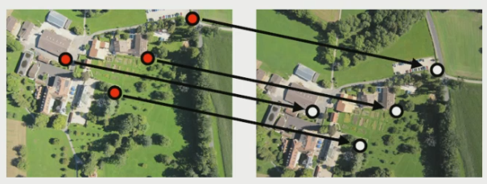
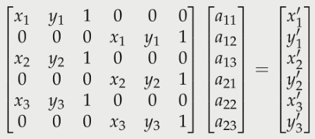
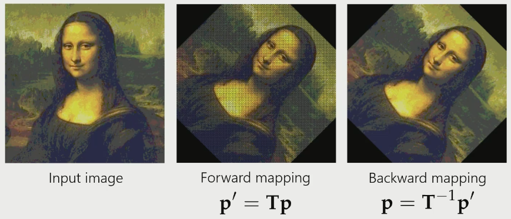
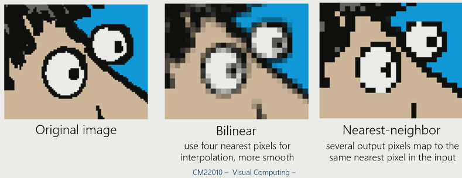
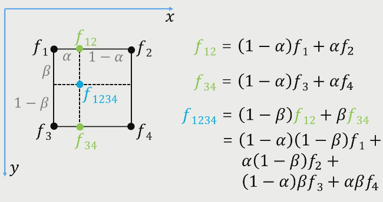

# 2D Projective Transformations and Image Warping

The affine transform matrix is:

$$
\left [
\begin {array} {}
a_{11} & a_{12} & t_1\\
a_{21} & a_{22} & t_2\\
0 & 0 & 1\\
\end {array}
\right ]
$$

The 0s at the bottom maintain parallel lines in the output image. What if we want to use all the elements in the matrix?

$$
\left [
\begin {array} {}
m_{11} & m_{12} & m_{13}\\
m_{12} & m_{22} & m_{23}\\
m_{31} & m_{32} & m_{33}\\
\end {array}
\right ]
$$

The transformation equations become:

$$
s
\left [
\begin {array} {}
p'_1\\
p'_2\\
1\\
\end {array}
\right ]
=\left [
\begin {array} {}
m_{11} & m_{12} & m_{13}\\
m_{12} & m_{22} & m_{23}\\
m_{31} & m_{32} & m_{33}\\
\end {array}
\right ]
\left [
\begin {array} {}
p_1\\
p_2\\
1\\
\end {array}
\right ]
$$

The scalar $s$ is there to preserve the bottom $1$ in the output image.

## Homographies

$$
H = 
\left [
\begin {array} {}
m_{11} & m_{12} & m_{13}\\
m_{12} & m_{22} & m_{23}\\
m_{31} & m_{32} & m_{33}\\
\end {array}
\right ]
$$

$H$ has 8 degrees of freedom, but 9 unknowns. We lose the scaling degree of freedom because the scalar is taken out of the output image as $s$.

## Image Alignment

We can use points which match each other on separate images to figure out what transformations were applied to the input image. 

### How many points are required

For affine maps, we only need 3 points. This is because each point has 2 coordinates $x$ and $y$, meaning 3 points gives us 6 equations which covers the 6 degrees of freedom.

For homographies, we need 4 points because there are 8 degrees of freedom. 

### Computing Affine transformations

$$
\left [
\begin {array} {}
x'\\
y'\\
1\\
\end {array}
\right ]
=\left [
\begin {array} {}
a_{11} & a_{12} & t_1\\
a_{21} & a_{22} & t_2\\
0 & 0 & 1\\
\end {array}
\right ]
\left [
\begin {array} {}
x\\
y\\
1\\
\end {array}
\right ]
$$

We can rearrange this equation to solve for $x$ and $y$.

$$
\left [
\begin {array} {}
x & y & 1 & 0 & 0 & 0\\
0 & 0 & 0 & x & y & 1\\
\end {array}
\right ]
\left [
\begin {array} {}
a_{11}\\
a_{12}\\
t_1\\
a_{21}\\
a_{22}\\
t_2\\
\end {array}
\right ]
=\left [
\begin {array} {}
x'\\
y'\\
\end {array}
\right ]
$$

We need 3 points to solve though, so:

### Stitching

We can use the points which we have matched to stitch the images together to get a larger image. 

## Image Warping

To avoid having gaps in the pixels due to rounding the transformed coordinates, we use backward mapping to fix this. 

### Nearest Neighbour interpolation

### Binlinaer interpolation

