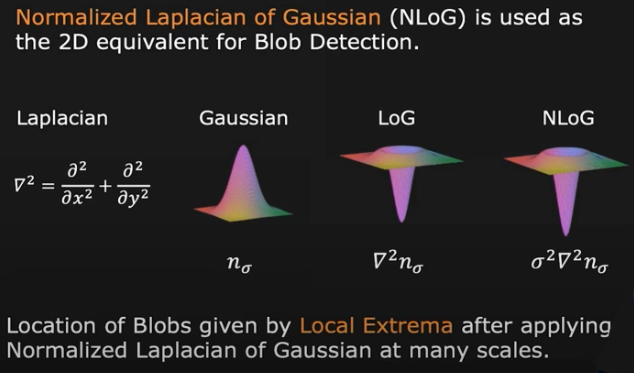
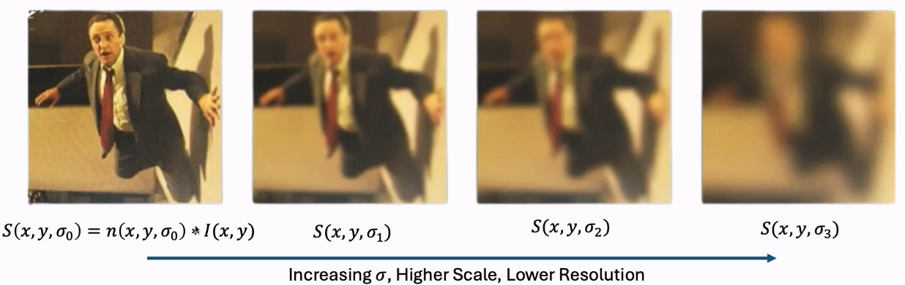
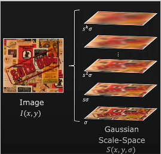
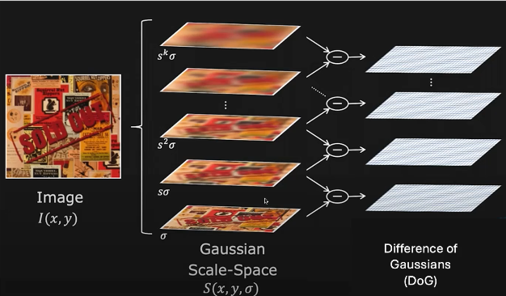
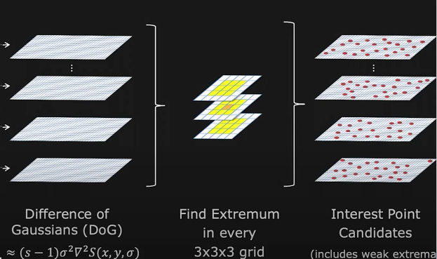
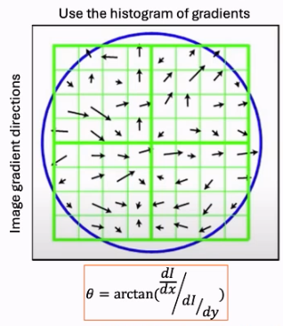
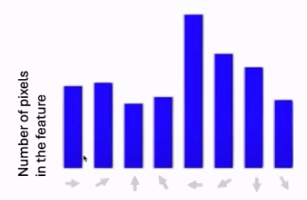
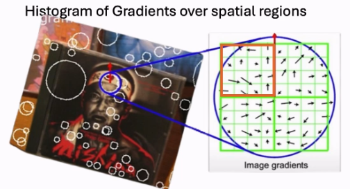
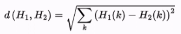
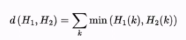

# Video

A video is a sequence of individual images called frames. They are played in rapid succession to create the illusion of motion. 

## SIFT (scale invarianty feature transform) Detectors

It is used for image alignment and stitching, as well as 2D object recognition in video. 

## What is an interest point?

Raw images and videos are hard to match because of different size, orientation, lighting, brightness etc.

### Definition

- Has rich image content (variation in brightness, colour, etc.) in a local window
- Well defined representation (signature) for matching other points.
- Has a well defined position in the image.
- Should be invariant to image rotation and scaling.
- Should be insensitive to lighting changes. 

### Blobs

Blobs are areas that has variations in gradients in the image. 

To detect 2D blobs, we use laplacian:

LoG is laplacian of gaussian. NLoG is normalised laplacian of gaussian.

#### Example

This creates a vertical (pictured horizontally) stack of images convolved with Gaussians of different $\sigma$ values. 

$$\sigma _k = \sigma _0 S^k, k=0,1,2,3,...$$

$S$ is a constant, $\sigma _0$ is the initial scale. 

*return to this, lecture made no sense*

#### Fast NLoG Approximation: DoG

$$\text{DoG} = (n_{s\sigma} - n_{\sigma}) \sim (s-1)\text{NLoG}$$

To find the extremum, we check each 3x3x3 grid and pick the highest pixel value in it.

We then remove weak extrema based on some threshold. After this, we have obtained our SIFT interest points. 

The scale of the gaussian gives the scale of the blob.

### SIFT scale invariance trick

Ratio of blob sizes: $$\frac {\sigma_1 ^*} {\sigma_2 ^*}$$

This makes the blobs the same scale. 

### Computing the Principal Orientation

The images need to be orientation invariant. The principal component needs to be calculated to do this. 

This is the arctan of the gradient of the image over the x axis divided by the gradient over the y axis. 

We can make a histogram of how many different pixels have a certain gradient:

The peak is the principal orientation of the feature. Once the peak has been found, we just rotate the other image so that the peaks point in the same direction. 

### SIFT descriptor

How do we match the blobs between different frames in the video? 

Once rotated using the principal orientation, we take the 4 quadrants and create a histogram of each of their gradients. These 4 histograms are concatenated and this is the signature of the blob. These are normalised. 

#### Matching

We can now use a distance metric to simply match two arrays of data. 

L2 distance: 

The smaller, the closer the SIFT descriptors are. 

Similarity score:

This finds the minimum of... idk

